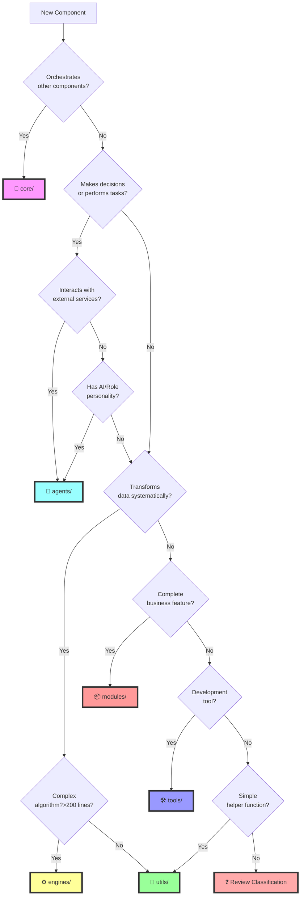

# 🔄 CAIA Component Classification Flowchart

## Visual Decision Flow



## 🎯 Quick Examples by Category

### 📁 **core/** Examples
```
✅ Goes in core:
- CAIA main orchestrator
- Plugin system
- Event bus
- Service registry
- Dependency injection container
- Component lifecycle manager

❌ Doesn't go in core:
- Individual agents
- Utility functions
- Business logic
```

### 🤖 **agents/** Examples
```
✅ Goes in agents:
- jira-connect (Jira API operations)
- npm-connector (NPM management)
- github-sync (GitHub operations)
- slack-notifier (Sends notifications)
- product-owner (Requirements gathering)
- code-reviewer (Reviews code)
- translator (Translates content)
- web-scraper (Fetches web data)

❌ Doesn't go in agents:
- JSON formatter (→ utils)
- Code generator without decision-making (→ engines)
- Authentication system (→ modules)
```

### ⚙️ **engines/** Examples
```
✅ Goes in engines:
- template-engine (Processes templates)
- markdown-engine (Converts markdown)
- code-synthesis (Generates code)
- minifier-engine (Minifies code)
- parser-engine (Parses languages)
- consensus-engine (Calculates agreement)
- optimization-engine (Optimizes performance)
- compilation-engine (Compiles code)

❌ Doesn't go in engines:
- API client (→ agents)
- Simple formatter (→ utils)
- Business workflow (→ modules)
```

### 🔧 **utils/** Examples
```
✅ Goes in utils:
- logger (Console logging)
- validator (Input validation)
- slugify (URL slug creation)
- debounce (Function debouncing)
- deep-clone (Object cloning)
- retry (Retry logic)
- date-formatter (Format dates)
- string-utils (String helpers)

❌ Doesn't go in utils:
- Complex API client (→ agents)
- Template processor (→ engines)
- Full authentication (→ modules)
```

### 📦 **modules/** Examples
```
✅ Goes in modules:
- authentication (Complete auth system)
- ecommerce (Cart, checkout, orders)
- blog-system (Posts, comments, tags)
- payment-gateway (Multiple processors)
- analytics-dashboard (Full analytics)
- cms (Content management)
- crm (Customer relations)
- booking-system (Reservations)

❌ Doesn't go in modules:
- Single API integration (→ agents)
- Data transformer (→ engines)
- Helper function (→ utils)
```

### 🛠️ **tools/** Examples
```
✅ Goes in tools:
- cli (Command line interface)
- debugger (Debug assistant)
- profiler (Performance profiler)
- mock-server (Dev server)
- test-generator (Creates tests)
- doc-generator (Creates docs)
- migration-tool (Database migrations)
- seed-tool (Database seeding)

❌ Doesn't go in tools:
- Production service (→ agents/modules)
- Business logic (→ modules)
- Data transformer (→ engines)
```

## 🤔 Common Confusions Resolved

### "It's an API client" - Agent or Util?
```
Simple REST wrapper (< 100 lines) → utils/
Complex client with retry, auth, etc → agents/
```

### "It generates something" - Agent or Engine?
```
Just transforms A to B → engines/
Makes decisions about what to generate → agents/
```

### "It's AI-powered" - Agent or Engine?
```
Uses AI to make decisions → agents/
Uses AI for transformation → engines/
```

### "It's a complete feature" - Module or Multiple Agents?
```
Self-contained business domain → modules/
Needs orchestration of roles → multiple agents/
```

### "It processes data" - Engine or Util?
```
< 200 lines, single function → utils/
Complex pipeline, multiple steps → engines/
```

## 📏 Size Guidelines

```
utils/      : 1-200 lines
engines/    : 200-2000 lines  
agents/     : 200-2000 lines
modules/    : 1000+ lines
tools/      : Any size
core/       : Any size
```

## 🎨 Naming Conventions

```
core:    No prefix needed
agents:  @caia/agent-{name}
engines: @caia/engine-{name}
utils:   @caia/util-{name}
modules: @caia/module-{name}
tools:   @caia/tool-{name}
```

## ✅ Final Checklist

Before creating your component, answer these:

1. **Primary Purpose?**
   - [ ] Orchestrates → `core/`
   - [ ] Performs tasks → `agents/`
   - [ ] Transforms data → `engines/`
   - [ ] Helps other code → `utils/`
   - [ ] Business feature → `modules/`
   - [ ] Dev assistance → `tools/`

2. **Complexity?**
   - [ ] Very simple → `utils/`
   - [ ] Medium → `agents/` or `engines/`
   - [ ] Complex → `modules/` or `core/`

3. **Dependencies?**
   - [ ] None → `utils/`
   - [ ] External APIs → `agents/`
   - [ ] Multiple systems → `modules/`

4. **Who uses it?**
   - [ ] Other components → `utils/` or `engines/`
   - [ ] End users → `modules/`
   - [ ] Developers → `tools/`
   - [ ] CAIA itself → `core/`

If still unsure, ask in Discord or create an issue for discussion!