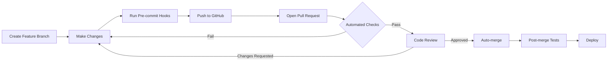

# 🚀 CAIA Pull Request Workflow Guide

## 📋 Overview

This repository enforces a strict pull request (PR) workflow to ensure code quality, maintain stability, and automate the review process. **Direct commits to the main branch are prohibited.**

## 🔒 Branch Protection Rules

### Main Branch Protection
- ❌ **No direct commits** - All changes must go through PRs
- ✅ **Required status checks** must pass before merging
- ✅ **At least 1 approval** required from code owners
- ✅ **Up-to-date branches** required before merging
- ✅ **Conversation resolution** required
- ✅ **Stale review dismissal** enabled

## 🌊 Development Workflow



## 📝 Step-by-Step Process

### 1. Create a Feature Branch
```bash
# Always pull latest main first
git checkout main
git pull origin main

# Create and checkout new branch
git checkout -b feature/your-feature-name
# or
git checkout -b fix/your-bug-fix
# or
git checkout -b docs/your-doc-update
```

### 2. Make Your Changes
- Write your code
- Add tests
- Update documentation if needed
- Ensure code follows project standards

### 3. Commit Your Changes
```bash
# Pre-commit hooks will run automatically
git add .
git commit -m "feat: add new feature"

# If pre-commit hooks fail:
# 1. Fix the issues
# 2. Stage fixes
# 3. Commit again
```

### 4. Push to GitHub
```bash
git push origin feature/your-feature-name
```

### 5. Create Pull Request
- Go to GitHub repository
- Click "Compare & pull request"
- Follow PR template
- Ensure title follows conventional commits format

## 🤖 Automated PR Checks

### Quick Checks (Run First)
- **PR Title Validation** - Must follow conventional commits
- **PR Description** - Must be at least 50 characters
- **File Changes Detection** - Determines which tests to run

### Parallel Static Analysis
- **Linting** - ESLint checks
- **Type Checking** - TypeScript validation
- **Format Check** - Prettier formatting

### Parallel Testing
- **Unit Tests** - Run in 4 parallel shards
- **Integration Tests** - API, Database, Auth, Workflows
- **Coverage Reports** - Uploaded to Codecov

### Security & Quality
- **Dependency Review** - Check for vulnerable dependencies
- **Security Scan** - Trivy and Snyk scanning
- **Bundle Size** - Monitor package sizes
- **Code Quality** - SonarCloud analysis

## 🏷️ PR Labels

Automatically applied based on:
- **Size**: `size/xs`, `size/s`, `size/m`, `size/l`, `size/xl`
- **Scope**: `core`, `agents`, `engines`, `ci/cd`, `documentation`
- **Status**: `needs-review`, `approved`, `changes-requested`, `hold`
- **Type**: `enhancement`, `bug`, `documentation`, `dependencies`

## ⚡ PR Commands

Comment these commands on your PR:

- `/rebase` - Rebase PR on main branch
- `/update-branch` - Update branch from main
- `/ready` - Mark draft PR as ready for review
- `/hold` - Prevent auto-merge (adds `hold` label)

## 🔄 Auto-merge

PRs will automatically merge when:
1. ✅ All required checks pass
2. ✅ At least 1 approval from code owner
3. ✅ No `hold` or `do-not-merge` labels
4. ✅ All conversations resolved
5. ✅ Branch is up-to-date with main

## 🚀 Post-Merge Actions

After merging to main:
1. **Parallel Package Tests** - All packages tested in parallel
2. **Integration Tests** - Full integration test suite
3. **Performance Tests** - Lighthouse and k6 load testing
4. **Security Scans** - Full security analysis
5. **Documentation Deploy** - Auto-deploy to GitHub Pages
6. **NPM Publish** - Publish changed packages (if version bumped)

## ⚡ Performance Optimizations

### PR Checks Optimization
- **Parallel Execution**: Tests run in 4 shards
- **Smart Caching**: Dependencies, ESLint, TypeScript caches
- **Affected Only**: Only test changed packages
- **Turbo Build**: Incremental builds with Turborepo
- **Cancel Previous**: Auto-cancel outdated workflow runs

### Expected Timings
- Quick Checks: ~30 seconds
- Static Analysis: ~1-2 minutes (parallel)
- Unit Tests: ~2-3 minutes (4x parallel shards)
- Build: ~1-2 minutes (cached)
- **Total PR Check Time**: ~3-5 minutes

## 📊 Monitoring

### PR Metrics Dashboard
- Average PR review time
- Test success rates
- Most common failures
- Bundle size trends
- Coverage trends

### Notifications
- Slack notifications for failures
- GitHub comments for status updates
- Email notifications for reviewers

## 🛠️ Troubleshooting

### Common Issues

#### Pre-commit Hook Fails
```bash
# Run linting locally
npm run lint

# Fix automatically where possible
npm run lint:fix

# Run tests locally
npm run test:all
```

#### PR Checks Failing
1. Check the specific failing job in GitHub Actions
2. Run the same command locally
3. Fix issues and push updates

#### Merge Conflicts
```bash
# Update your branch
git checkout main
git pull origin main
git checkout your-branch
git rebase main

# Resolve conflicts
git add .
git rebase --continue
git push --force-with-lease
```

## 🔧 Local Setup

### Enable Pre-commit Hooks
```bash
npm install
npx husky install
```

### Run All Checks Locally
```bash
# Run same checks as CI
npm run lint
npm run typecheck
npm run test:all
npm run build:all
```

### Using Turbo for Speed
```bash
# Install Turbo globally
npm install -g turbo

# Run builds with caching
turbo run build

# Run only affected packages
turbo run build --filter='...[origin/main]'
```

## 📚 Best Practices

1. **Keep PRs Small** - Easier to review, less likely to have conflicts
2. **Write Descriptive PR Titles** - Follow conventional commits
3. **Update Tests** - Add/update tests for your changes
4. **Document Changes** - Update README/docs if needed
5. **Review Your Own PR** - Check the diff before requesting review
6. **Respond to Feedback** - Address review comments promptly
7. **Use Draft PRs** - For work in progress
8. **Link Issues** - Reference related issues in PR description

## 🚨 Emergency Procedures

### Bypass Protection (Admin Only)
```bash
# Only in emergencies - requires admin access
git push origin main --force
```

### Rollback Bad Merge
```bash
# Revert the merge commit
git revert -m 1 <merge-commit-hash>
git push origin main
```

## 📞 Getting Help

- Check this guide first
- Review failed check logs in GitHub Actions
- Ask in #dev-help Slack channel
- Tag @prakashgbid for urgent issues

---

Remember: **The PR workflow ensures code quality and prevents bugs from reaching production. Following it helps the entire team!**