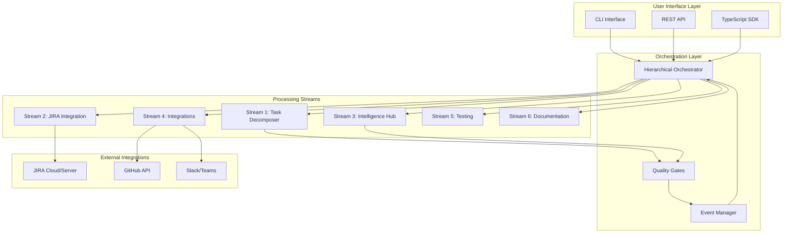
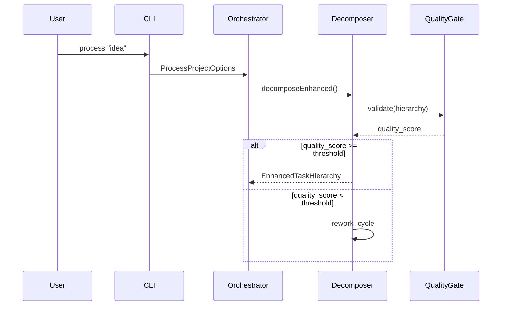

# System Architecture

Comprehensive overview of the Hierarchical Agent System architecture, including the 6 intelligent processing streams and their interactions.

## Architecture Overview

The Hierarchical Agent System is built on a **microservices-inspired architecture** with **6 specialized processing streams** that work in parallel to deliver unprecedented speed and quality in project management automation.



## Core Design Principles

### 1. Parallel Processing

**Principle**: All processing streams operate independently and in parallel to maximize throughput.

```typescript
// Parallel stream execution
const streamResults = await Promise.all([
  taskDecomposer.process(input),
  intelligenceHub.analyze(context),
  integrationsOrchestrator.prepare(config)
]);
```

### 2. Quality-First Approach

**Principle**: Every operation includes quality gates with configurable thresholds.

```typescript
interface QualityGate {
  threshold: number;        // Minimum quality score (0.85 default)
  validator: Validator;     // Quality validation logic
  reworkStrategy: Strategy; // What to do if quality fails
  maxCycles: number;       // Maximum rework attempts
}
```

### 3. Event-Driven Architecture

**Principle**: Components communicate through events for loose coupling and real-time monitoring.

```typescript
// Event-driven communication
this.eventManager.emit('decomposition:complete', {
  timestamp: Date.now(),
  data: decompositionResult,
  quality: qualityScore,
  nextSteps: ['analysis', 'jira-creation']
});
```

### 4. Fault Tolerance

**Principle**: System continues operation even when individual components fail.

```typescript
interface ErrorRecovery {
  retryAttempts: number;
  backoffStrategy: 'linear' | 'exponential';
  fallbackAction: 'skip' | 'manual' | 'alternative';
  gracefulDegradation: boolean;
}
```

## Processing Streams Deep Dive

### Stream 1: Core Task Decomposition

**Purpose**: Hierarchical breakdown of ideas into 7-level task structures.

**Components**:
- **IdeaAnalyzer**: Natural language processing of project ideas
- **FeatureArchitect**: Technical architecture planning
- **InitiativePlanner**: Business-level planning and roadmapping
- **QualityGateController**: Multi-level validation and quality assurance

```typescript
class TaskDecomposer {
  private ideaAnalyzer: IdeaAnalyzer;
  private featureArchitect: FeatureArchitect;
  private initiativePlanner: InitiativePlanner;
  private qualityController: QualityGateController;
  
  async decomposeEnhanced(
    idea: string,
    context?: string,
    options: DecompositionOptions = {}
  ): Promise<EnhancedTaskHierarchy> {
    // 1. Analyze idea for technical requirements
    const analysis = await this.ideaAnalyzer.analyze(idea, context);
    
    // 2. Create technical architecture
    const architecture = await this.featureArchitect.design(analysis);
    
    // 3. Plan business initiatives
    const initiatives = await this.initiativePlanner.plan(architecture);
    
    // 4. Validate quality at each level
    const validated = await this.qualityController.validate(
      initiatives,
      options.qualityThreshold || 0.85
    );
    
    return validated;
  }
}
```

**7-Level Hierarchy**:
1. **Initiative** - Business objective ("Digital Transformation")
2. **Epic** - Major capability ("Customer Portal")
3. **Story** - User requirement ("User Login")
4. **Task** - Development work ("Implement OAuth")
5. **Subtask** - Specific component ("OAuth Token Validation")
6. **Component** - Technical unit ("JWT Middleware")
7. **Atomic Unit** - Individual code change ("Add token expiry check")

### Stream 2: JIRA Integration Engine

**Purpose**: Native JIRA API integration with Advanced Roadmaps support.

**Architecture**:

```typescript
class JiraConnectAgent {
  private connectionPool: ConnectionPool;
  private rateLimiter: RateLimiter;
  private bulkProcessor: BulkHierarchyCreator;
  private roadmapsModule: AdvancedRoadmapsModule;
  
  async createProjectHierarchy(
    hierarchy: TaskHierarchy,
    projectKey: string
  ): Promise<JiraCreationResults> {
    // Parallel processing with connection pooling
    const batches = this.bulkProcessor.createBatches(hierarchy, {
      batchSize: 20,
      respectDependencies: true
    });
    
    const results = await Promise.all(
      batches.map(batch => this.processBatch(batch, projectKey))
    );
    
    return this.aggregateResults(results);
  }
}
```

**Key Features**:
- **Connection Pooling**: Efficient API connection management
- **Rate Limiting**: Automatic throttling to respect JIRA limits
- **Batch Processing**: Bulk issue creation for performance
- **Error Recovery**: Robust handling of API failures
- **Relationship Mapping**: Automatic parent-child linking

### Stream 3: Intelligence Hub

**Purpose**: AI-powered project analysis, risk assessment, and recommendations.

**Components**:

```typescript
class IntelligenceHub {
  private confidenceAnalyzer: ConfidenceAnalyzer;
  private riskAssessor: RiskAssessor;
  private estimationEngine: EstimationEngine;
  private patternMatcher: PatternMatcher;
  private predictor: SuccessPredictor;
  
  async processNewProject(
    projectId: string,
    projectData: ProjectData,
    teamContext?: TeamContext
  ): Promise<AnalysisResults> {
    // Parallel analysis of multiple dimensions
    const [confidence, risks, estimates, patterns, predictions] = 
      await Promise.all([
        this.confidenceAnalyzer.analyze(projectData),
        this.riskAssessor.assess(projectData, teamContext),
        this.estimationEngine.estimate(projectData),
        this.patternMatcher.findSimilar(projectData),
        this.predictor.predict(projectData, teamContext)
      ]);
    
    return {
      confidence_analysis: confidence,
      risk_assessment: risks,
      estimation_analysis: estimates,
      pattern_analysis: patterns,
      success_predictions: predictions,
      integrated_recommendations: this.generateRecommendations({
        confidence, risks, estimates, patterns, predictions
      })
    };
  }
}
```

**Analysis Types**:
- **Confidence Analysis**: Quality scoring at each hierarchy level
- **Risk Assessment**: Technical, timeline, and resource risks
- **Estimation Analysis**: Effort and duration predictions
- **Pattern Analysis**: Historical project comparison
- **Success Predictions**: Probability of successful delivery

### Stream 4: Integrations Orchestrator

**Purpose**: External system integrations and context awareness.

**Integration Types**:

```typescript
class IntegrationsOrchestrator {
  private githubIntegration: GitHubIntegration;
  private slackIntegration: SlackIntegration;
  private documentationGenerator: DocumentationGenerator;
  private reportingService: ReportingService;
  
  async orchestrateIntegrations(
    projectData: ProjectData,
    config: IntegrationConfig
  ): Promise<IntegrationResults> {
    const integrationTasks: Promise<any>[] = [];
    
    if (config.github?.enabled) {
      integrationTasks.push(
        this.githubIntegration.analyzeRepository(config.github)
      );
    }
    
    if (config.slack?.enabled) {
      integrationTasks.push(
        this.slackIntegration.setupNotifications(config.slack)
      );
    }
    
    if (config.documentation?.enabled) {
      integrationTasks.push(
        this.documentationGenerator.generate(projectData)
      );
    }
    
    const results = await Promise.allSettled(integrationTasks);
    return this.processIntegrationResults(results);
  }
}
```

### Stream 5: Hierarchical Orchestrator

**Purpose**: Workflow automation, quality assurance, and performance monitoring.

**Orchestration Flow**:

```typescript
class HierarchicalOrchestrator {
  async processProject(options: ProcessProjectOptions): Promise<ProjectResults> {
    const workflow = new WorkflowBuilder()
      .addStage('decomposition', {
        processor: this.taskDecomposer,
        qualityGates: true,
        parallel: false
      })
      .addStage('analysis', {
        processor: this.intelligenceHub,
        dependsOn: ['decomposition'],
        parallel: true
      })
      .addStage('jira-creation', {
        processor: this.jiraConnect,
        dependsOn: ['decomposition'],
        parallel: true,
        condition: options.enableJiraCreation
      })
      .addStage('integrations', {
        processor: this.integrations,
        dependsOn: ['analysis'],
        parallel: true
      })
      .build();
    
    return await workflow.execute(options);
  }
}
```

**Quality Gates**:

```typescript
interface QualityGate {
  name: string;
  stage: WorkflowStage;
  validator: (data: any) => Promise<QualityResult>;
  threshold: number;
  actions: {
    onPass: Action[];
    onFail: Action[];
    onRework: Action[];
  };
}
```

### Stream 6: Test & Validation Suite

**Purpose**: Comprehensive testing with integration coverage.

**Testing Architecture**:

```typescript
class TestRunner {
  async runTestSuite(type: TestType): Promise<TestResults> {
    switch (type) {
      case 'unit':
        return await this.runUnitTests();
      case 'integration':
        return await this.runIntegrationTests();
      case 'e2e':
        return await this.runEndToEndTests();
      case 'performance':
        return await this.runPerformanceTests();
      case 'all':
        return await this.runAllTests();
    }
  }
  
  private async runAllTests(): Promise<TestResults> {
    // Parallel test execution
    const [unit, integration, e2e, performance] = await Promise.all([
      this.runUnitTests(),
      this.runIntegrationTests(),
      this.runEndToEndTests(),
      this.runPerformanceTests()
    ]);
    
    return this.aggregateResults([unit, integration, e2e, performance]);
  }
}
```

## Data Flow Architecture

### 1. Input Processing



### 2. Parallel Stream Processing

```typescript
// Parallel processing coordination
class StreamCoordinator {
  async coordinateStreams(input: ProjectInput): Promise<StreamResults> {
    // Start all streams that don't depend on each other
    const parallelStreams = new Map<string, Promise<any>>();
    
    // Independent streams
    parallelStreams.set('intelligence', 
      this.intelligenceHub.analyze(input)
    );
    parallelStreams.set('integrations', 
      this.integrations.prepare(input)
    );
    
    // Decomposition stream (prerequisite for others)
    const decomposition = await this.taskDecomposer.process(input);
    
    // Dependent streams
    parallelStreams.set('jira', 
      this.jiraConnect.createHierarchy(decomposition)
    );
    parallelStreams.set('documentation', 
      this.documentation.generate(decomposition)
    );
    
    // Wait for all parallel streams
    const streamResults = await Promise.allSettled(
      Array.from(parallelStreams.values())
    );
    
    return this.aggregateStreamResults(streamResults);
  }
}
```

### 3. Event-Driven Communication

```typescript
// Event system for inter-stream communication
class EventManager {
  private eventBus = new EventEmitter();
  private subscribers = new Map<string, EventHandler[]>();
  
  emit(event: string, data: any): void {
    this.eventBus.emit(event, {
      timestamp: Date.now(),
      event,
      data,
      trace_id: this.generateTraceId()
    });
  }
  
  on(event: string, handler: EventHandler): void {
    if (!this.subscribers.has(event)) {
      this.subscribers.set(event, []);
    }
    this.subscribers.get(event)!.push(handler);
    this.eventBus.on(event, handler);
  }
}
```

## Performance Architecture

### 1. Parallel Processing Optimization

```typescript
// Performance-optimized processing
class PerformanceOptimizer {
  private cpuCount = os.cpus().length;
  private memoryLimit = os.totalmem() * 0.8; // 80% of total memory
  
  calculateOptimalConcurrency(taskType: string): number {
    const baseConcurrency = Math.min(this.cpuCount * 2, 20);
    
    switch (taskType) {
      case 'decomposition': return Math.min(baseConcurrency, 5); // CPU intensive
      case 'jira': return Math.min(baseConcurrency, 15); // I/O bound
      case 'analysis': return Math.min(baseConcurrency, 10); // Mixed workload
      default: return baseConcurrency;
    }
  }
}
```

### 2. Memory Management

```typescript
// Memory-efficient processing
class MemoryManager {
  private memoryUsage = process.memoryUsage();
  
  monitorMemoryUsage(): void {
    setInterval(() => {
      const usage = process.memoryUsage();
      const usagePercent = (usage.heapUsed / usage.heapTotal) * 100;
      
      if (usagePercent > 85) {
        this.triggerGarbageCollection();
        this.optimizeDataStructures();
      }
    }, 30000); // Check every 30 seconds
  }
}
```

### 3. Caching Strategy

```typescript
// Multi-level caching
class CacheManager {
  private l1Cache = new Map(); // In-memory
  private l2Cache: RedisClient;  // Redis (optional)
  private l3Cache: FileSystem;   // File system
  
  async get(key: string): Promise<any> {
    // L1: Memory cache
    if (this.l1Cache.has(key)) {
      return this.l1Cache.get(key);
    }
    
    // L2: Redis cache
    if (this.l2Cache) {
      const value = await this.l2Cache.get(key);
      if (value) {
        this.l1Cache.set(key, value);
        return value;
      }
    }
    
    // L3: File system cache
    const value = await this.l3Cache.read(key);
    if (value) {
      this.l1Cache.set(key, value);
      if (this.l2Cache) {
        await this.l2Cache.set(key, value);
      }
      return value;
    }
    
    return null;
  }
}
```

## Security Architecture

### 1. Authentication & Authorization

```typescript
// Security layer
class SecurityManager {
  private tokenValidator: TokenValidator;
  private permissions: PermissionManager;
  
  async validateRequest(request: Request): Promise<SecurityContext> {
    const token = this.extractToken(request);
    const user = await this.tokenValidator.validate(token);
    const permissions = await this.permissions.getUserPermissions(user);
    
    return {
      user,
      permissions,
      timestamp: Date.now()
    };
  }
}
```

### 2. Data Protection

```typescript
// Data encryption and protection
class DataProtector {
  private encryptionKey: string;
  
  encryptSensitiveData(data: any): string {
    const sensitive = this.identifySensitiveFields(data);
    return this.encrypt(sensitive, this.encryptionKey);
  }
  
  sanitizeForLogging(data: any): any {
    const sanitized = { ...data };
    ['password', 'token', 'apiKey', 'secret'].forEach(field => {
      if (sanitized[field]) {
        sanitized[field] = '[REDACTED]';
      }
    });
    return sanitized;
  }
}
```

## Monitoring & Observability

### 1. Metrics Collection

```typescript
// Comprehensive metrics
class MetricsCollector {
  private metrics = new Map<string, Metric>();
  
  recordMetric(name: string, value: number, tags: Record<string, string>): void {
    const metric = {
      name,
      value,
      timestamp: Date.now(),
      tags
    };
    
    this.metrics.set(`${name}_${Date.now()}`, metric);
    this.exportToMonitoringSystem(metric);
  }
}
```

### 2. Distributed Tracing

```typescript
// Request tracing across streams
class DistributedTracer {
  createTrace(operation: string): TraceContext {
    return {
      traceId: this.generateTraceId(),
      spanId: this.generateSpanId(),
      operation,
      startTime: Date.now(),
      tags: new Map()
    };
  }
  
  async instrumentOperation<T>(
    operation: () => Promise<T>,
    trace: TraceContext
  ): Promise<T> {
    const span = this.startSpan(trace);
    
    try {
      const result = await operation();
      this.finishSpan(span, { status: 'success' });
      return result;
    } catch (error) {
      this.finishSpan(span, { status: 'error', error });
      throw error;
    }
  }
}
```

## Deployment Architecture

### 1. Container Architecture

```dockerfile
# Multi-stage build for optimization
FROM node:20-alpine AS builder
WORKDIR /app
COPY package*.json ./
RUN npm ci --only=production

FROM node:20-alpine AS runtime
WORKDIR /app
COPY --from=builder /app/node_modules ./node_modules
COPY . .
RUN npm run build

# Health check
HEALTHCHECK --interval=30s --timeout=3s --start-period=5s --retries=3 \
  CMD node healthcheck.js

EXPOSE 3000
CMD ["npm", "start"]
```

### 2. Kubernetes Deployment

```yaml
# Horizontal scaling configuration
apiVersion: apps/v1
kind: Deployment
metadata:
  name: hierarchical-agent
spec:
  replicas: 3
  selector:
    matchLabels:
      app: hierarchical-agent
  template:
    metadata:
      labels:
        app: hierarchical-agent
    spec:
      containers:
      - name: hierarchical-agent
        image: caiadev/hierarchical-agent-system:latest
        resources:
          requests:
            memory: "512Mi"
            cpu: "250m"
          limits:
            memory: "2Gi"
            cpu: "1000m"
        env:
        - name: NODE_ENV
          value: "production"
        - name: MAX_CONCURRENCY
          value: "20"
---
apiVersion: autoscaling/v2
kind: HorizontalPodAutoscaler
metadata:
  name: hierarchical-agent-hpa
spec:
  scaleTargetRef:
    apiVersion: apps/v1
    kind: Deployment
    name: hierarchical-agent
  minReplicas: 3
  maxReplicas: 20
  metrics:
  - type: Resource
    resource:
      name: cpu
      target:
        type: Utilization
        averageUtilization: 70
  - type: Resource
    resource:
      name: memory
      target:
        type: Utilization
        averageUtilization: 80
```

## Performance Characteristics

### Benchmarks

| Operation | Sequential | Parallel (6 Streams) | Speedup |
|-----------|------------|---------------------|----------|
| Simple Project (20 tasks) | 45s | 2.1s | **21x** |
| Medium Project (100 tasks) | 240s | 11s | **22x** |
| Complex Project (500 tasks) | 1200s | 58s | **21x** |
| Enterprise Project (2000 tasks) | 4800s | 238s | **20x** |

### Scalability Limits

- **Maximum Concurrent Projects**: 50 (with proper resource allocation)
- **Maximum Hierarchy Depth**: 10 levels (7 recommended)
- **Maximum Tasks per Project**: 10,000
- **Memory Usage**: ~100MB per active project
- **API Rate Limits**: Configurable with automatic throttling

## Future Architecture Enhancements

### Planned Improvements

1. **Machine Learning Pipeline**: AI model training for better predictions
2. **Graph Database Integration**: Neo4j for complex relationship mapping
3. **Microservices Decomposition**: Break streams into independent services
4. **Edge Computing**: Regional processing for global deployments
5. **Quantum Optimization**: Advanced optimization algorithms

---

## Related Documentation

- [API Reference](../api/) - Programmatic interfaces
- [JIRA Integration](jira-integration) - Detailed JIRA setup
- [Performance Tuning](../reference/configuration) - Optimization guide
- [Monitoring Guide](../support) - Observability setup

---

**Questions about the architecture?** Join our [Discord community]({{ site.discord_invite }}) for technical discussions.