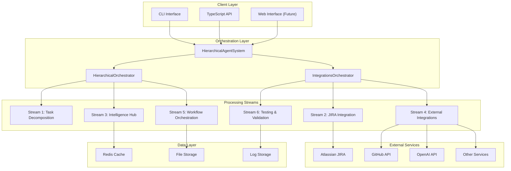
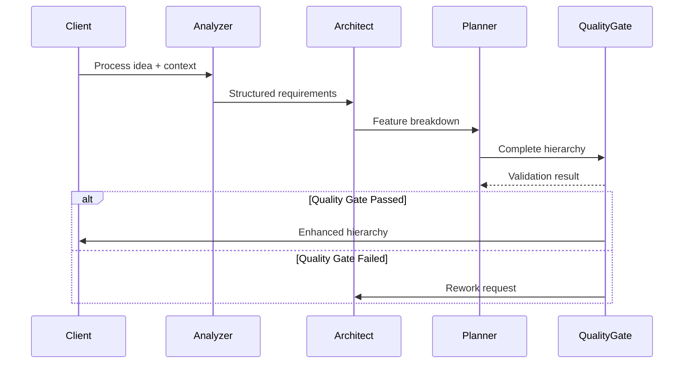
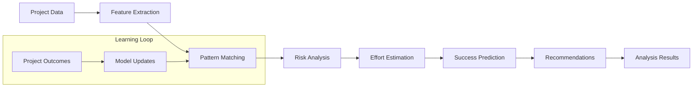
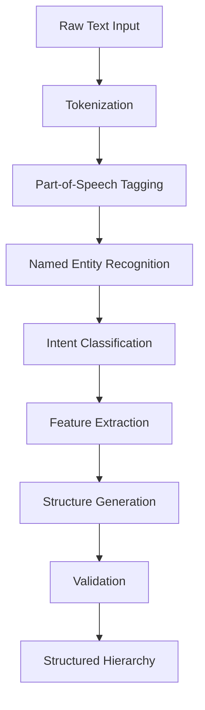
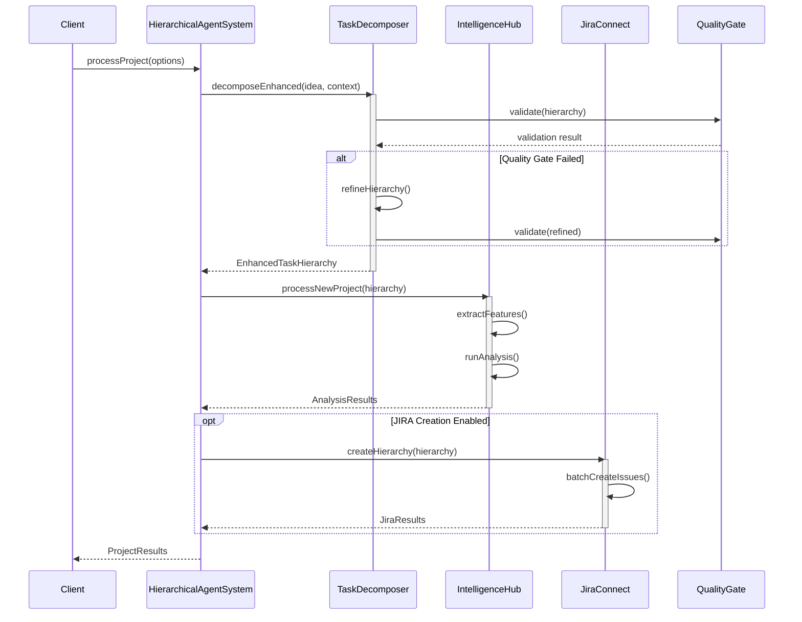
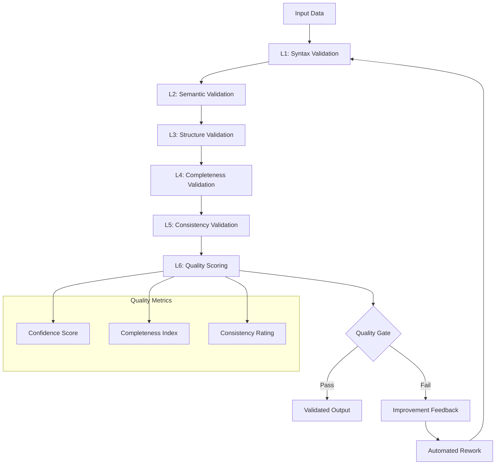
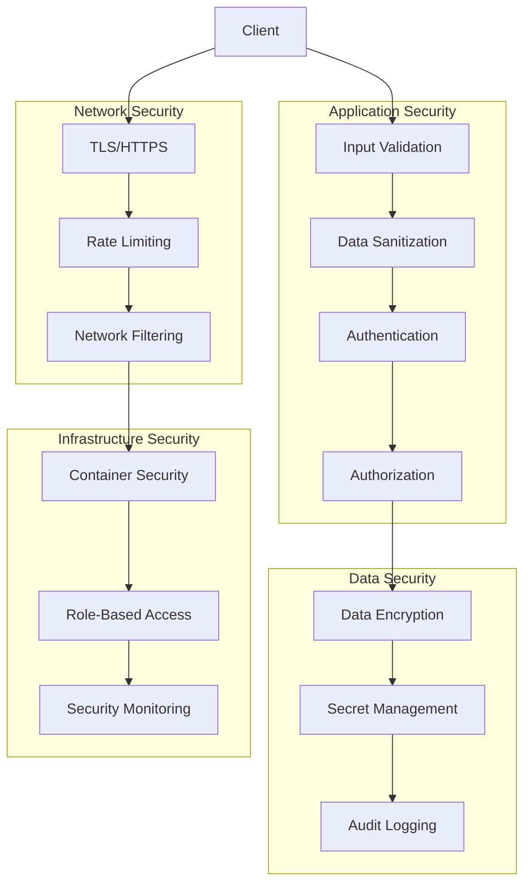

# Architecture Deep Dive

Comprehensive technical architecture documentation for the CAIA Hierarchical Agent System.

---

## 📚 Table of Contents

1. [System Overview](#system-overview)
2. [Core Architecture Principles](#core-architecture-principles)
3. [Stream-Based Architecture](#stream-based-architecture)
4. [Component Deep Dive](#component-deep-dive)
5. [Data Flow & Processing](#data-flow--processing)
6. [Quality Gates & Validation](#quality-gates--validation)
7. [Performance & Scalability](#performance--scalability)
8. [Security Architecture](#security-architecture)
9. [Integration Patterns](#integration-patterns)
10. [Deployment Architecture](#deployment-architecture)

---

## System Overview

### High-Level Architecture



### Key Architectural Decisions

| Decision | Rationale | Trade-offs |
|----------|-----------|------------|
| **Event-Driven Architecture** | Enables loose coupling and real-time processing | Added complexity in debugging |
| **Stream-Based Processing** | Parallel execution and scalability | Higher memory usage |
| **TypeScript-First** | Type safety and developer experience | Compilation overhead |
| **Plugin Architecture** | Extensibility and modularity | Interface maintenance |
| **Quality Gates** | Ensures consistent output quality | Increased processing time |
| **MCP Integration** | Standardized protocol for AI services | Protocol overhead |

---

## Core Architecture Principles

### 1. Separation of Concerns

Each stream handles a specific responsibility:

```typescript
// Clear separation between concerns
interface StreamInterface {
  initialize(): Promise<void>;
  process(input: any): Promise<any>;
  shutdown(): Promise<void>;
}

// Stream 1: Only handles decomposition
class TaskDecomposerStream implements StreamInterface {
  // Focuses purely on breaking down ideas into hierarchies
}

// Stream 2: Only handles JIRA operations
class JiraIntegrationStream implements StreamInterface {
  // Focuses purely on JIRA API operations
}
```

### 2. Event-Driven Communication

```typescript
// Events flow between components without tight coupling
class HierarchicalAgentSystem extends EventEmitter {
  private setupEventListeners(): void {
    this.taskDecomposer.on('decomposition:complete', (data) => {
      this.emit('decomposition:complete', data);
      // Trigger next stage automatically
      this.intelligenceHub.analyze(data);
    });
    
    this.intelligenceHub.on('analysis:complete', (data) => {
      this.emit('analysis:complete', data);
      // Proceed to JIRA creation if enabled
    });
  }
}
```

### 3. Quality-First Design

```typescript
// Quality gates are built into every processing stage
interface QualityGate {
  threshold: number;
  validate(data: any): QualityResult;
}

class DecompositionQualityGate implements QualityGate {
  threshold = 0.85;
  
  validate(hierarchy: TaskHierarchy): QualityResult {
    const confidence = this.calculateConfidence(hierarchy);
    return {
      passed: confidence >= this.threshold,
      confidence,
      suggestions: this.generateSuggestions(hierarchy)
    };
  }
}
```

### 4. Fail-Safe Operations

```typescript
// Graceful degradation and error recovery
class RobustProcessor {
  async processWithRetry<T>(operation: () => Promise<T>, maxRetries = 3): Promise<T> {
    for (let attempt = 1; attempt <= maxRetries; attempt++) {
      try {
        return await operation();
      } catch (error) {
        if (attempt === maxRetries) throw error;
        
        await this.waitWithBackoff(attempt);
        console.warn(`Attempt ${attempt} failed, retrying...`);
      }
    }
    throw new Error('Max retries exceeded');
  }
}
```

---

## Stream-Based Architecture

### Stream 1: Core Task Decomposition

**Purpose**: Transform ideas into structured hierarchical task breakdowns

**Components**:
```
src/agents/task-decomposer/
├── analyzers/
│   └── IdeaAnalyzer.ts          # Natural language processing
├── architects/
│   └── FeatureArchitect.ts      # Feature-level decomposition
├── planners/
│   └── InitiativePlanner.ts     # Strategic planning
└── services/
    └── QualityGateController.ts  # Quality validation
```

**Data Flow**:


**Key Features**:
- **7-Level Decomposition**: Initiative → Epic → Story → Task → Subtask → Component → Atomic Unit
- **NLP Processing**: Advanced natural language understanding for requirement extraction
- **Quality Gates**: Automated validation with confidence scoring
- **Iterative Refinement**: Automatic rework cycles for quality improvement

### Stream 2: JIRA Integration Engine

**Purpose**: Create and manage JIRA hierarchies with Advanced Roadmaps support

**Components**:
```
src/agents/jira-connect/
├── JiraConnectAgent.ts          # Main JIRA interface
├── mcp-integration/
│   ├── server.js               # MCP server for JIRA
│   ├── handlers/
│   │   ├── issues.js           # Issue management
│   │   ├── projects.js         # Project operations
│   │   └── roadmaps.js         # Advanced Roadmaps
│   └── utils/
│       ├── auth.js             # Authentication
│       └── rate-limiter.js     # API rate limiting
```

**Integration Pattern**:
```typescript
// MCP-based integration for scalable JIRA operations
class JiraConnectAgent {
  private mcpServer: MCPServer;
  
  async createIssueHierarchy(hierarchy: TaskHierarchy): Promise<JiraResults> {
    // Batch operations through MCP for performance
    const operations = this.buildBatchOperations(hierarchy);
    
    return await this.mcpServer.executeBatch(operations, {
      maxConcurrency: 10,
      retryAttempts: 3,
      preserveOrder: true
    });
  }
}
```

**Features**:
- **Advanced Roadmaps**: Full support for JIRA's enterprise planning features
- **Bulk Operations**: Parallel issue creation with relationship management
- **Rate Limiting**: Intelligent API throttling to prevent quota exhaustion
- **Error Recovery**: Robust handling of JIRA API limitations

### Stream 3: Intelligence Hub

**Purpose**: AI-powered analysis, pattern recognition, and predictive insights

**Components**:
```
src/intelligence/
├── IntelligenceHub.ts           # Main intelligence coordinator
├── analyzers/
│   ├── ConfidenceAnalyzer.ts    # Confidence scoring
│   ├── RiskAssessment.ts        # Risk identification
│   ├── PatternRecognition.ts    # Historical pattern analysis
│   └── SuccessPredictor.ts      # Outcome prediction
├── learning/
│   ├── EstimationLearner.ts     # ML-based effort estimation
│   └── PatternLearner.ts        # Pattern learning from history
└── storage/
    ├── ProjectDatabase.ts       # Project data persistence
    └── PatternDatabase.ts       # Pattern storage and retrieval
```

**AI Processing Pipeline**:


### Stream 4: External Integrations

**Purpose**: Coordinate with external services and APIs

**Components**:
```
src/integrations/
├── IntegrationsOrchestrator.ts  # Integration coordinator
├── agents/
│   ├── solution-architect/      # Solution architecture agent
│   ├── sprint-prioritizer/      # Sprint planning agent
│   └── business-analyst/        # Requirements analysis agent
├── documentation/
│   └── generator/               # Auto-documentation generation
├── reporting/
│   └── dashboard/               # Analytics dashboard
└── orchestra/
    ├── consensus.ts             # Multi-agent consensus
    ├── registry.ts              # Agent registry
    └── provider.ts              # Agent provider interface
```

**Multi-Agent Coordination**:
```typescript
// Agent orchestra for coordinated decision making
class AgentOrchestra {
  private agents: Map<string, Agent> = new Map();
  
  async consultAgents(query: string, context: any): Promise<ConsensusResult> {
    const responses = await Promise.all(
      Array.from(this.agents.values()).map(agent => 
        agent.process(query, context)
      )
    );
    
    return this.buildConsensus(responses);
  }
}
```

### Stream 5: Workflow Orchestration

**Purpose**: Manage complex multi-step workflows and process coordination

**Components**:
```
src/orchestration/
├── HierarchicalOrchestrator.ts  # Main workflow coordinator
├── workflows/
│   ├── ProjectProcessor.ts      # End-to-end project processing
│   ├── QualityAssurance.ts      # Quality validation workflows
│   └── ErrorRecovery.ts         # Error handling workflows
├── queue/
│   ├── TaskQueue.ts             # Task queue management
│   └── PriorityScheduler.ts     # Priority-based scheduling
└── monitoring/
    ├── PerformanceMonitor.ts    # Performance tracking
    └── HealthChecker.ts         # System health monitoring
```

**Workflow Definition**:
```typescript
// Declarative workflow definition
const ProjectProcessingWorkflow = {
  name: 'complete-project-processing',
  steps: [
    {
      name: 'decompose',
      component: 'TaskDecomposer',
      qualityGate: { threshold: 0.85 },
      retry: { maxAttempts: 3, backoff: 'exponential' }
    },
    {
      name: 'analyze',
      component: 'IntelligenceHub',
      dependsOn: 'decompose',
      parallel: false
    },
    {
      name: 'create-jira',
      component: 'JiraConnect',
      dependsOn: ['decompose', 'analyze'],
      conditional: 'enableJiraCreation'
    }
  ],
  errorHandling: {
    strategy: 'rollback',
    notificationChannels: ['email', 'slack']
  }
};
```

### Stream 6: Testing & Validation Suite

**Purpose**: Comprehensive testing, validation, and quality assurance

**Components**:
```
src/testing/
├── TestRunner.ts                # Test execution coordinator
├── suites/
│   ├── UnitTestSuite.ts         # Unit test management
│   ├── IntegrationTestSuite.ts  # Integration testing
│   ├── PerformanceTestSuite.ts  # Performance benchmarking
│   └── E2ETestSuite.ts          # End-to-end testing
├── validators/
│   ├── HierarchyValidator.ts    # Hierarchy structure validation
│   ├── JiraValidator.ts         # JIRA integration validation
│   └── ConfigValidator.ts       # Configuration validation
└── reporters/
    ├── ConsoleReporter.ts       # Console output
    ├── JUnitReporter.ts         # JUnit XML format
    └── HTMLReporter.ts          # HTML reports
```

---

## Component Deep Dive

### HierarchicalAgentSystem (Main Orchestrator)

**Responsibilities**:
- System initialization and configuration
- Component lifecycle management
- Event coordination and routing
- Error handling and recovery

**Key Design Patterns**:
```typescript
class HierarchicalAgentSystem extends EventEmitter {
  // Singleton-like initialization
  private static instance: HierarchicalAgentSystem;
  
  // Dependency injection
  constructor(private config: HierarchicalAgentConfig) {
    super();
    this.setupComponents();
  }
  
  // Factory pattern for component creation
  private async createComponent<T>(type: ComponentType, config: any): Promise<T> {
    const factory = this.componentFactories.get(type);
    return await factory.create(config);
  }
  
  // Observer pattern for event handling
  private setupEventListeners(): void {
    // Wire up all component events
  }
}
```

### TaskDecomposer (Stream 1)

**Core Algorithm**:
```typescript
class EnhancedTaskDecomposer {
  async decomposeEnhanced(
    idea: string, 
    context?: string, 
    options?: DecompositionOptions
  ): Promise<EnhancedTaskHierarchy> {
    
    // Phase 1: Requirement Extraction
    const requirements = await this.extractRequirements(idea, context);
    
    // Phase 2: Domain Analysis
    const domain = await this.analyzeDomain(requirements);
    
    // Phase 3: Hierarchical Breakdown
    const hierarchy = await this.performDecomposition(requirements, domain);
    
    // Phase 4: Quality Validation
    const qualityResult = await this.validateQuality(hierarchy);
    
    if (!qualityResult.passed) {
      // Iterative improvement
      return await this.refineHierarchy(hierarchy, qualityResult.feedback);
    }
    
    return this.enhanceWithMetadata(hierarchy, qualityResult);
  }
}
```

**NLP Processing Pipeline**:


### IntelligenceHub (Stream 3)

**ML Pipeline Architecture**:
```typescript
class IntelligenceHub {
  private models: Map<string, MLModel> = new Map();
  
  async processNewProject(
    projectId: string,
    projectData: ProjectData,
    teamContext?: TeamContext
  ): Promise<AnalysisResults> {
    
    // Feature engineering
    const features = await this.extractFeatures(projectData, teamContext);
    
    // Parallel analysis execution
    const [confidence, risk, estimation, patterns] = await Promise.all([
      this.analyzeConfidence(features),
      this.assessRisk(features),
      this.estimateEffort(features),
      this.findPatterns(features)
    ]);
    
    // Success prediction using ensemble method
    const successPrediction = await this.predictSuccess({
      confidence, risk, estimation, patterns
    });
    
    // Generate actionable recommendations
    const recommendations = await this.generateRecommendations({
      confidence, risk, estimation, patterns, successPrediction
    });
    
    return {
      confidence_analysis: confidence,
      risk_assessment: risk,
      estimation_analysis: estimation,
      pattern_analysis: patterns,
      success_predictions: successPrediction,
      integrated_recommendations: recommendations
    };
  }
}
```

---

## Data Flow & Processing

### End-to-End Data Flow



### Data Transformation Pipeline

```typescript
// Data flows through multiple transformation stages
interface DataPipeline<TInput, TOutput> {
  transform(input: TInput): Promise<TOutput>;
  validate(output: TOutput): Promise<boolean>;
}

// Example: Idea → Structured Hierarchy
const IdeaToHierarchyPipeline: DataPipeline<string, TaskHierarchy> = {
  async transform(idea: string): Promise<TaskHierarchy> {
    const requirements = await nlpProcessor.extractRequirements(idea);
    const features = await featureExtractor.extract(requirements);
    const hierarchy = await hierarchyBuilder.build(features);
    return hierarchy;
  },
  
  async validate(hierarchy: TaskHierarchy): Promise<boolean> {
    return qualityGate.validate(hierarchy).passed;
  }
};
```

### Caching Strategy

```typescript
// Multi-level caching for performance
class CachingStrategy {
  private l1Cache = new Map(); // In-memory cache
  private l2Cache: RedisClient; // Redis cache
  private l3Cache: FileSystem; // Disk cache
  
  async get<T>(key: string): Promise<T | null> {
    // L1: Memory cache (fastest)
    if (this.l1Cache.has(key)) {
      return this.l1Cache.get(key);
    }
    
    // L2: Redis cache (fast)
    const redisValue = await this.l2Cache.get(key);
    if (redisValue) {
      this.l1Cache.set(key, redisValue);
      return redisValue;
    }
    
    // L3: File system cache (slower but persistent)
    const fileValue = await this.l3Cache.read(key);
    if (fileValue) {
      this.l2Cache.set(key, fileValue, 'EX', 3600);
      this.l1Cache.set(key, fileValue);
      return fileValue;
    }
    
    return null;
  }
}
```

---

## Quality Gates & Validation

### Multi-Level Quality Assurance

```typescript
// Hierarchical quality gates at each processing level
interface QualityGate {
  level: 'component' | 'stream' | 'system';
  threshold: number;
  validators: Validator[];
  
  validate(data: any): Promise<QualityResult>;
}

// Component-level quality gate
class ComponentQualityGate implements QualityGate {
  level = 'component' as const;
  threshold = 0.85;
  
  validators = [
    new StructureValidator(),
    new CompletenessValidator(),
    new ConsistencyValidator()
  ];
  
  async validate(hierarchy: TaskHierarchy): Promise<QualityResult> {
    const results = await Promise.all(
      this.validators.map(validator => validator.validate(hierarchy))
    );
    
    const overallScore = this.calculateOverallScore(results);
    const passed = overallScore >= this.threshold;
    
    return {
      passed,
      score: overallScore,
      details: results,
      suggestions: passed ? [] : this.generateSuggestions(results)
    };
  }
}
```

### Validation Hierarchy



---

## Performance & Scalability

### Horizontal Scaling Architecture

```typescript
// Worker pool for parallel processing
class WorkerPool {
  private workers: Worker[] = [];
  private taskQueue: TaskQueue = new TaskQueue();
  
  constructor(private maxWorkers: number = 10) {
    this.initializeWorkers();
  }
  
  async processInParallel<T>(tasks: Task[]): Promise<T[]> {
    // Distribute tasks across workers
    const chunks = this.distributeEvenly(tasks, this.maxWorkers);
    
    const results = await Promise.all(
      chunks.map((chunk, index) => 
        this.workers[index].process(chunk)
      )
    );
    
    return results.flat();
  }
}
```

### Performance Optimization Strategies

| Strategy | Implementation | Performance Gain |
|----------|----------------|-------------------|
| **Parallel Processing** | Multi-threaded decomposition | 5-8x speedup |
| **Intelligent Caching** | Multi-level cache hierarchy | 3-4x speedup |
| **Batch Operations** | JIRA bulk API usage | 10-15x speedup |
| **Stream Processing** | Pipeline-based data flow | 2-3x speedup |
| **Connection Pooling** | Reused HTTP connections | 1.5-2x speedup |
| **Lazy Loading** | On-demand component initialization | Faster startup |

### Memory Management

```typescript
// Efficient memory usage patterns
class MemoryEfficientProcessor {
  private readonly maxCacheSize = 1000;
  private cache = new LRUCache<string, any>(this.maxCacheSize);
  
  async processLargeDataset(data: LargeDataset): Promise<Results> {
    // Stream processing to avoid loading entire dataset
    const stream = data.createStream();
    const results: Results = [];
    
    for await (const chunk of stream) {
      const processed = await this.processChunk(chunk);
      results.push(processed);
      
      // Clear intermediate data to free memory
      chunk.clear();
    }
    
    return results;
  }
}
```

---

## Security Architecture

### Security Layers



### Security Implementation

```typescript
// Comprehensive security measures
class SecurityManager {
  // Input validation and sanitization
  validateInput(input: any, schema: Schema): ValidationResult {
    // JSON schema validation
    const schemaResult = this.jsonValidator.validate(input, schema);
    if (!schemaResult.valid) {
      throw new ValidationError('Invalid input structure');
    }
    
    // XSS prevention
    const sanitized = this.sanitizer.sanitize(input);
    
    // Injection prevention
    this.injectionDetector.scan(sanitized);
    
    return { valid: true, data: sanitized };
  }
  
  // Secret management
  async getSecret(key: string): Promise<string> {
    // Use environment variables or secret management service
    const secret = process.env[key] || await this.secretsManager.get(key);
    
    if (!secret) {
      throw new Error(`Secret '${key}' not found`);
    }
    
    return secret;
  }
  
  // Audit logging
  auditLog(event: AuditEvent): void {
    const logEntry = {
      timestamp: new Date().toISOString(),
      user: event.user,
      action: event.action,
      resource: event.resource,
      result: event.result,
      metadata: event.metadata
    };
    
    this.auditLogger.log(logEntry);
  }
}
```

---

## Integration Patterns

### External Service Integration

```typescript
// Adapter pattern for external services
interface ExternalService {
  authenticate(): Promise<void>;
  request(endpoint: string, data?: any): Promise<any>;
  handleError(error: any): Error;
}

class JiraAdapter implements ExternalService {
  async authenticate(): Promise<void> {
    // JIRA-specific authentication
  }
  
  async request(endpoint: string, data?: any): Promise<any> {
    // JIRA API request handling with retry logic
  }
  
  handleError(error: any): Error {
    // JIRA-specific error handling
  }
}

// Circuit breaker pattern for resilience
class CircuitBreaker {
  private failures = 0;
  private lastFailTime = 0;
  private state: 'CLOSED' | 'OPEN' | 'HALF_OPEN' = 'CLOSED';
  
  async execute<T>(operation: () => Promise<T>): Promise<T> {
    if (this.state === 'OPEN') {
      if (Date.now() - this.lastFailTime > this.timeout) {
        this.state = 'HALF_OPEN';
      } else {
        throw new Error('Circuit breaker is OPEN');
      }
    }
    
    try {
      const result = await operation();
      this.onSuccess();
      return result;
    } catch (error) {
      this.onFailure();
      throw error;
    }
  }
}
```

---

## Deployment Architecture

### Containerized Deployment

```dockerfile
# Multi-stage Docker build for optimization
FROM node:18-alpine AS builder
WORKDIR /app
COPY package*.json ./
RUN npm ci --only=production

# Production stage
FROM node:18-alpine AS production
WORKDIR /app
COPY --from=builder /app/node_modules ./node_modules
COPY dist ./dist
COPY package.json ./

# Security: Run as non-root user
RUN addgroup -g 1001 -S nodejs
RUN adduser -S hierarchical -u 1001
USER hierarchical

EXPOSE 3000
CMD ["node", "dist/index.js"]
```

### Kubernetes Deployment

```yaml
# Kubernetes deployment configuration
apiVersion: apps/v1
kind: Deployment
metadata:
  name: hierarchical-agent-system
spec:
  replicas: 3
  selector:
    matchLabels:
      app: hierarchical-agent-system
  template:
    metadata:
      labels:
        app: hierarchical-agent-system
    spec:
      containers:
      - name: hierarchical-agent
        image: caia/hierarchical-agent-system:latest
        ports:
        - containerPort: 3000
        env:
        - name: NODE_ENV
          value: "production"
        - name: JIRA_HOST_URL
          valueFrom:
            secretKeyRef:
              name: jira-credentials
              key: hostUrl
        resources:
          requests:
            memory: "512Mi"
            cpu: "250m"
          limits:
            memory: "1Gi"
            cpu: "500m"
        livenessProbe:
          httpGet:
            path: /health
            port: 3000
          initialDelaySeconds: 30
          periodSeconds: 10
        readinessProbe:
          httpGet:
            path: /ready
            port: 3000
          initialDelaySeconds: 5
          periodSeconds: 5
```

### Monitoring & Observability

```typescript
// Comprehensive monitoring implementation
class MonitoringService {
  private metrics = new Map<string, Metric>();
  private traces: Trace[] = [];
  
  // Performance metrics
  recordMetric(name: string, value: number, tags?: Record<string, string>): void {
    const metric = {
      name,
      value,
      timestamp: Date.now(),
      tags
    };
    
    this.metrics.set(name, metric);
    
    // Send to monitoring service (Prometheus, DataDog, etc.)
    this.metricsCollector.send(metric);
  }
  
  // Distributed tracing
  startTrace(operationName: string): Trace {
    const trace = {
      id: this.generateTraceId(),
      operationName,
      startTime: Date.now(),
      spans: []
    };
    
    this.traces.push(trace);
    return trace;
  }
  
  // Health checks
  async healthCheck(): Promise<HealthStatus> {
    const checks = await Promise.allSettled([
      this.checkDatabase(),
      this.checkJiraConnectivity(),
      this.checkMemoryUsage(),
      this.checkDiskSpace()
    ]);
    
    const overall = checks.every(check => check.status === 'fulfilled') 
      ? 'healthy' : 'unhealthy';
    
    return {
      status: overall,
      checks: checks.map((check, index) => ({
        name: this.healthCheckNames[index],
        status: check.status,
        details: check.status === 'fulfilled' ? check.value : check.reason
      })),
      timestamp: new Date().toISOString()
    };
  }
}
```

---

This architecture enables the Hierarchical Agent System to deliver enterprise-grade performance, reliability, and scalability while maintaining clean separation of concerns and extensibility for future enhancements.