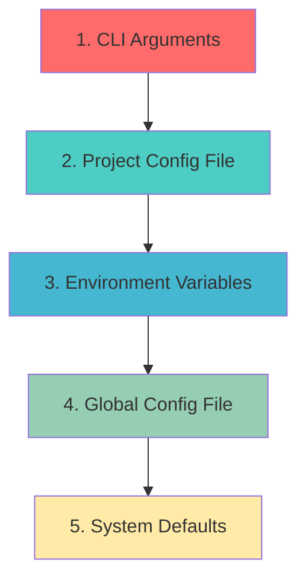

# Configuration Reference

Complete reference for all configuration options in the CAIA Hierarchical Agent System.

---

## 📚 Table of Contents

1. [Configuration Overview](#configuration-overview)
2. [Environment Variables](#environment-variables)
3. [Configuration Files](#configuration-files)
4. [Task Decomposer Configuration](#task-decomposer-configuration)
5. [JIRA Integration Configuration](#jira-integration-configuration)
6. [Intelligence Hub Configuration](#intelligence-hub-configuration)
7. [Orchestration Configuration](#orchestration-configuration)
8. [Integrations Configuration](#integrations-configuration)
9. [Logging & Monitoring Configuration](#logging--monitoring-configuration)
10. [Performance Tuning](#performance-tuning)
11. [Environment-Specific Configurations](#environment-specific-configurations)

---

## Configuration Overview

### Configuration Hierarchy

The system uses a layered configuration approach with the following precedence (highest to lowest):



### Configuration Sources

| Source | File Path | Priority | Use Case |
|--------|-----------|----------|----------|
| **CLI Arguments** | Command line | 1 (Highest) | Quick overrides |
| **Project Config** | `./hierarchical-config.json` | 2 | Project-specific settings |
| **Environment File** | `./.env` | 3 | Local development |
| **Global Config** | `~/.config/caia-hierarchical/config.json` | 4 | User preferences |
| **System Defaults** | Built-in | 5 (Lowest) | Fallback values |

---

## Environment Variables

### Core System Variables

```bash
# System Configuration
NODE_ENV=production                          # Runtime environment
CAIA_CONFIG_DIR=~/.config/caia-hierarchical  # Configuration directory
CAIA_DATA_DIR=./data                         # Data storage directory
CAIA_LOG_LEVEL=info                          # Logging level
CAIA_DEBUG=false                             # Debug mode

# Performance Settings
CAIA_MAX_CONCURRENCY=10                      # Maximum concurrent operations
CAIA_WORKER_THREADS=4                        # Worker thread count
CAIA_MEMORY_LIMIT=2048                       # Memory limit in MB
CAIA_TIMEOUT=300000                          # Default timeout in ms
```

### JIRA Integration Variables

```bash
# JIRA Connection (Required for JIRA features)
JIRA_HOST_URL=https://company.atlassian.net   # JIRA instance URL
JIRA_USERNAME=user@company.com               # JIRA username/email
JIRA_API_TOKEN=your-api-token-here           # JIRA API token
JIRA_PROJECT_KEY=DEFAULT                     # Default project key

# JIRA Performance
JIRA_MAX_BATCH_SIZE=50                       # Batch operation size
JIRA_REQUEST_TIMEOUT=30000                   # Request timeout
JIRA_RETRY_ATTEMPTS=3                        # Retry attempts
JIRA_RATE_LIMIT=100                          # Requests per minute

# JIRA Features
JIRA_ENABLE_ROADMAPS=true                    # Advanced Roadmaps support
JIRA_ENABLE_BULK_OPS=true                    # Bulk operations
JIRA_AUTO_ASSIGNMENT=false                   # Auto-assign issues
```

### GitHub Integration Variables

```bash
# GitHub Integration (Optional)
GITHUB_TOKEN=github_pat_your_token_here      # GitHub personal access token
GITHUB_ORG=your-organization                 # Default organization
GITHUB_REPO=your-repository                  # Default repository
GITHUB_API_URL=https://api.github.com        # GitHub API URL
```

### Intelligence & Analytics Variables

```bash
# Intelligence Hub
INTELLIGENCE_ROOT=./intelligence-data        # Intelligence data directory
INTELLIGENCE_DEBUG=false                     # Intelligence debug mode
INTELLIGENCE_CACHE_TTL=3600                  # Cache TTL in seconds
INTELLIGENCE_ML_ENABLED=true                 # Enable ML features

# AI/ML Services
OPENAI_API_KEY=your-openai-key               # OpenAI API key (if used)
OPENAI_ORG_ID=your-org-id                    # OpenAI organization ID
HUGGING_FACE_TOKEN=your-hf-token             # Hugging Face token
```

### Logging Variables

```bash
# Logging Configuration
LOG_LEVEL=info                               # debug|info|warn|error
LOG_DIR=./logs                               # Log file directory
ENABLE_FILE_LOGGING=true                     # Enable file logging
LOG_MAX_FILES=10                             # Maximum log files
LOG_MAX_SIZE=10485760                       # Max log file size (10MB)

# Audit Logging
ENABLE_AUDIT_LOG=true                        # Enable audit logging
AUDIT_LOG_DIR=./logs/audit                  # Audit log directory
AUDIT_RETENTION_DAYS=90                     # Audit log retention
```

### Feature Flags

```bash
# Feature Toggles
ENABLE_ANALYTICS=true                        # Analytics features
ENABLE_ADVANCED_ROADMAPS=true               # JIRA Advanced Roadmaps
ENABLE_AUTO_DOCUMENTATION=true              # Auto-documentation
ENABLE_PERFORMANCE_MONITORING=true          # Performance monitoring
ENABLE_REAL_TIME_UPDATES=true              # Real-time updates
```

---

## Configuration Files

### Global Configuration File

**Location**: `~/.config/caia-hierarchical/config.json`

```json
{
  "version": "1.0.0",
  "lastUpdated": "2024-12-28T10:00:00Z",
  "global": {
    "userId": "user@company.com",
    "defaultProject": "DEFAULT",
    "timezone": "UTC",
    "locale": "en-US"
  },
  "taskDecomposer": {
    "enableHierarchicalDecomposition": true,
    "maxDepth": 7,
    "qualityGateThreshold": 0.85,
    "maxReworkCycles": 3,
    "enableGitHubIntegration": true,
    "nlpProvider": "internal",
    "confidenceThreshold": 0.75
  },
  "jiraConnect": {
    "enableAdvancedRoadmaps": true,
    "defaultAssignee": null,
    "autoTransitions": false,
    "bulkOperations": {
      "maxBatchSize": 50,
      "concurrency": 5,
      "retryAttempts": 3,
      "backoffMultiplier": 2
    },
    "customFields": {
      "storyPoints": "customfield_10001",
      "epicName": "customfield_10002",
      "acceptanceCriteria": "customfield_10003"
    }
  },
  "intelligence": {
    "enableAnalytics": true,
    "confidenceThreshold": 0.85,
    "enableHistoricalAnalysis": true,
    "patternRecognition": {
      "enableLearning": true,
      "minPatternOccurrences": 3,
      "confidenceThreshold": 0.7
    },
    "riskAssessment": {
      "enablePredictiveAnalysis": true,
      "riskFactors": ["complexity", "dependencies", "team_experience"],
      "mitigationSuggestions": true
    }
  },
  "orchestration": {
    "maxConcurrency": 10,
    "enableQualityGates": true,
    "retryAttempts": 3,
    "timeoutMs": 300000,
    "enableProgressTracking": true,
    "enableRollback": true
  },
  "integrations": {
    "enableReporting": true,
    "enableDocumentation": true,
    "enableOrchestra": true,
    "enableSlackNotifications": false,
    "enableEmailNotifications": false
  },
  "logging": {
    "level": "info",
    "enableFileLogging": true,
    "enableConsoleLogging": true,
    "logDir": "./logs",
    "maxFiles": 10,
    "maxSize": "10m",
    "enableAuditLog": true,
    "enableMetrics": true
  },
  "performance": {
    "enableCaching": true,
    "cacheProvider": "memory",
    "cacheTTL": 3600,
    "enableCompression": true,
    "enableConnectionPooling": true,
    "maxMemoryUsage": "2GB"
  },
  "security": {
    "enableInputValidation": true,
    "enableRateLimiting": true,
    "enableAuditLogging": true,
    "secretsProvider": "environment",
    "enableEncryption": false
  }
}
```

### Project Configuration File

**Location**: `./hierarchical-config.json`

```json
{
  "$schema": "https://schemas.caia.dev/hierarchical-config.schema.json",
  "projectName": "E-commerce Platform",
  "projectKey": "ECOM",
  "version": "1.0.0",
  "created": "2024-12-28T10:00:00Z",
  "taskDecomposer": {
    "enableHierarchicalDecomposition": true,
    "maxDepth": 6,
    "qualityGateThreshold": 0.90,
    "maxReworkCycles": 5,
    "domainSpecificRules": {
      "ecommerce": {
        "requirePaymentSecurity": true,
        "requireDataProtection": true,
        "requireScalabilityConsiderations": true
      }
    }
  },
  "jiraConnect": {
    "projectKey": "ECOM",
    "defaultIssueType": "Story",
    "defaultPriority": "Medium",
    "labels": ["ecommerce", "automated"],
    "customFields": {
      "businessValue": "customfield_10100",
      "technicalComplexity": "customfield_10101",
      "riskLevel": "customfield_10102"
    },
    "workflow": {
      "createInStatus": "To Do",
      "enableAutoTransitions": false
    }
  },
  "intelligence": {
    "projectContext": {
      "domain": "ecommerce",
      "scale": "enterprise",
      "userBase": "100k+",
      "dataVolume": "high"
    },
    "teamContext": {
      "size": 12,
      "experienceLevel": "senior",
      "technologies": ["react", "nodejs", "postgresql", "redis"],
      "methodologies": ["agile", "scrum"]
    },
    "estimationRules": {
      "baseVelocity": 40,
      "complexityMultipliers": {
        "low": 1.0,
        "medium": 1.5,
        "high": 2.5,
        "critical": 4.0
      }
    }
  },
  "qualityGates": {
    "decomposition": {
      "minConfidence": 0.90,
      "requireAcceptanceCriteria": true,
      "requireTestScenarios": true
    },
    "analysis": {
      "minSuccessProbability": 0.75,
      "maxRiskLevel": "medium",
      "requireMitigationPlans": true
    }
  }
}
```

---

## Task Decomposer Configuration

### Core Decomposer Settings

```typescript
interface TaskDecomposerConfig {
  // Basic decomposition settings
  enableHierarchicalDecomposition: boolean;  // Default: true
  maxDepth: number;                          // Default: 7
  qualityGateThreshold: number;              // Default: 0.85
  maxReworkCycles: number;                   // Default: 3
  
  // GitHub integration
  githubToken?: string;                      // Optional
  enableGitHubIntegration: boolean;          // Default: false
  
  // NLP and processing
  nlpProvider: 'internal' | 'openai' | 'huggingface';  // Default: 'internal'
  confidenceThreshold: number;               // Default: 0.75
  enableContextualAnalysis: boolean;         // Default: true
  
  // Domain-specific rules
  domainRules?: {
    [domain: string]: DomainSpecificRules;
  };
  
  // Quality gates
  qualityGate: {
    globalConfidenceThreshold: number;       // Default: 0.85
    maxReworkCycles: number;                 // Default: 3
    enableStructureValidation: boolean;      // Default: true
    enableCompletenessCheck: boolean;        // Default: true
    enableConsistencyCheck: boolean;         // Default: true
  };
}
```

### Decomposition Levels Configuration

```json
{
  "decompositionLevels": {
    "initiative": {
      "level": 1,
      "name": "Initiative",
      "timeframe": "6-18 months",
      "requiredFields": ["businessValue", "strategicAlignment"],
      "validation": {
        "minChildren": 1,
        "maxChildren": 8,
        "requiresApproval": true
      }
    },
    "epic": {
      "level": 2,
      "name": "Epic",
      "timeframe": "2-12 weeks",
      "requiredFields": ["userPersona", "businessGoal"],
      "validation": {
        "minChildren": 2,
        "maxChildren": 15,
        "requiresStoryPoints": true
      }
    },
    "story": {
      "level": 3,
      "name": "User Story",
      "timeframe": "1-5 days",
      "requiredFields": ["userStory", "acceptanceCriteria"],
      "validation": {
        "minChildren": 1,
        "maxChildren": 8,
        "requiresTestCases": true
      }
    },
    "task": {
      "level": 4,
      "name": "Development Task",
      "timeframe": "4-16 hours",
      "requiredFields": ["description", "estimatedHours"],
      "validation": {
        "maxChildren": 5,
        "requiresSkills": true
      }
    }
  }
}
```

---

## JIRA Integration Configuration

### Connection Configuration

```typescript
interface JiraConnectConfig {
  // Connection settings
  hostUrl: string;                           // JIRA instance URL
  username: string;                          // Username/email
  apiToken: string;                          // API token or password
  authMethod?: 'basic' | 'oauth' | 'pat';   // Authentication method
  
  // Feature flags
  enableAdvancedRoadmaps: boolean;           // Default: true
  enableBulkOperations: boolean;             // Default: true
  enableCustomFields: boolean;               // Default: true
  
  // Default values
  defaultProject?: string;                   // Default project key
  defaultAssignee?: string;                  // Default assignee
  defaultPriority?: string;                  // Default priority
  
  // Performance settings
  bulkOperations: {
    maxBatchSize: number;                    // Default: 50
    concurrency: number;                     // Default: 5
    retryAttempts: number;                   // Default: 3
    backoffMultiplier: number;               // Default: 2
    timeoutMs: number;                       // Default: 30000
  };
  
  // Field mappings
  customFields: {
    [fieldName: string]: string;             // Custom field IDs
  };
  
  // Issue type mappings
  issueTypes: {
    initiative: string;                      // Initiative issue type ID
    epic: string;                           // Epic issue type ID
    story: string;                          // Story issue type ID
    task: string;                           // Task issue type ID
    subtask: string;                        // Subtask issue type ID
  };
}
```

### Advanced Roadmaps Configuration

```json
{
  "advancedRoadmaps": {
    "enabled": true,
    "autoCreatePlans": true,
    "defaultSettings": {
      "timeframe": "quarters",
      "showDependencies": true,
      "showProgress": true,
      "enableCapacityPlanning": true,
      "enableScenarioPlanning": false
    },
    "hierarchyLevels": [
      {
        "level": 0,
        "name": "Initiative",
        "color": "#FF5722",
        "issueType": "Initiative"
      },
      {
        "level": 1,
        "name": "Epic",
        "color": "#9C27B0",
        "issueType": "Epic"
      },
      {
        "level": 2,
        "name": "Story",
        "color": "#4CAF50",
        "issueType": "Story"
      }
    ]
  }
}
```

---

## Intelligence Hub Configuration

### Core Intelligence Settings

```typescript
interface IntelligenceConfig {
  // Basic settings
  adminRoot: string;                         // Data storage root
  enableAnalytics: boolean;                  // Default: true
  confidenceThreshold: number;               // Default: 0.85
  
  // Analysis features
  enableHistoricalAnalysis: boolean;         // Default: true
  enablePredictiveAnalysis: boolean;         // Default: true
  enablePatternRecognition: boolean;         // Default: true
  enableRiskAssessment: boolean;             // Default: true
  
  // Machine Learning
  machineLearning: {
    enabled: boolean;                        // Default: true
    modelProvider: 'internal' | 'external';  // Default: 'internal'
    trainingEnabled: boolean;                // Default: true
    minTrainingData: number;                 // Default: 10
  };
  
  // Pattern recognition
  patternRecognition: {
    enableLearning: boolean;                 // Default: true
    minPatternOccurrences: number;           // Default: 3
    confidenceThreshold: number;             // Default: 0.7
    maxPatterns: number;                     // Default: 1000
  };
  
  // Risk assessment
  riskAssessment: {
    enablePredictiveAnalysis: boolean;       // Default: true
    riskFactors: string[];                   // Risk factors to consider
    mitigationSuggestions: boolean;          // Default: true
    riskThresholds: {
      low: number;                           // Default: 0.3
      medium: number;                        // Default: 0.6
      high: number;                          // Default: 0.8
    };
  };
}
```

### Analysis Configuration

```json
{
  "analysis": {
    "confidence": {
      "factors": [
        {
          "name": "requirement_clarity",
          "weight": 0.25,
          "description": "How clearly requirements are defined"
        },
        {
          "name": "technical_feasibility",
          "weight": 0.20,
          "description": "Technical feasibility assessment"
        },
        {
          "name": "team_experience",
          "weight": 0.20,
          "description": "Team experience with similar projects"
        },
        {
          "name": "complexity_assessment",
          "weight": 0.15,
          "description": "Project complexity evaluation"
        },
        {
          "name": "dependency_analysis",
          "weight": 0.10,
          "description": "Analysis of external dependencies"
        },
        {
          "name": "resource_availability",
          "weight": 0.10,
          "description": "Availability of required resources"
        }
      ],
      "thresholds": {
        "excellent": 0.9,
        "good": 0.8,
        "acceptable": 0.7,
        "poor": 0.6
      }
    },
    "risk": {
      "categories": [
        "technical",
        "resource",
        "timeline",
        "business",
        "external"
      ],
      "severityLevels": {
        "low": { "threshold": 0.3, "color": "green" },
        "medium": { "threshold": 0.6, "color": "yellow" },
        "high": { "threshold": 0.8, "color": "orange" },
        "critical": { "threshold": 1.0, "color": "red" }
      }
    }
  }
}
```

---

## Orchestration Configuration

### Workflow Orchestration

```typescript
interface OrchestrationConfig {
  // Concurrency settings
  maxConcurrency: number;                    // Default: 10
  workerThreads: number;                     // Default: 4
  queueSize: number;                         // Default: 1000
  
  // Quality gates
  enableQualityGates: boolean;               // Default: true
  qualityGateTimeout: number;                // Default: 60000
  qualityGateRetries: number;                // Default: 3
  
  // Retry logic
  retryAttempts: number;                     // Default: 3
  retryBackoffMs: number;                    // Default: 1000
  retryMultiplier: number;                   // Default: 2
  
  // Timeouts
  timeoutMs: number;                         // Default: 300000
  healthCheckInterval: number;               // Default: 30000
  
  // Features
  enableProgressTracking: boolean;           // Default: true
  enableRollback: boolean;                   // Default: true
  enableMetrics: boolean;                    // Default: true
  
  // Workflow definitions
  workflows: WorkflowDefinition[];
}
```

### Workflow Definition

```json
{
  "workflows": {
    "completeProjectProcessing": {
      "name": "Complete Project Processing",
      "description": "End-to-end project processing workflow",
      "steps": [
        {
          "id": "decompose",
          "name": "Task Decomposition",
          "component": "TaskDecomposer",
          "method": "decomposeEnhanced",
          "timeout": 120000,
          "retryAttempts": 3,
          "qualityGate": {
            "enabled": true,
            "threshold": 0.85
          }
        },
        {
          "id": "analyze",
          "name": "Intelligence Analysis",
          "component": "IntelligenceHub",
          "method": "processNewProject",
          "dependsOn": ["decompose"],
          "timeout": 90000,
          "parallel": false
        },
        {
          "id": "createJira",
          "name": "JIRA Creation",
          "component": "JiraConnect",
          "method": "createHierarchy",
          "dependsOn": ["decompose"],
          "timeout": 180000,
          "conditional": "enableJiraCreation",
          "errorHandling": "continue"
        }
      ],
      "errorHandling": {
        "strategy": "rollback",
        "maxFailures": 2,
        "notifications": ["email", "log"]
      }
    }
  }
}
```

---

## Integrations Configuration

### External Integrations

```typescript
interface IntegrationsConfig {
  // Feature flags
  enableReporting: boolean;                  // Default: true
  enableDocumentation: boolean;              // Default: true
  enableOrchestra: boolean;                  // Default: true
  enableSlackNotifications: boolean;         // Default: false
  enableEmailNotifications: boolean;         // Default: false
  
  // Agent orchestra
  agentOrchestra: {
    enabled: boolean;                        // Default: true
    maxAgents: number;                       // Default: 10
    consensusThreshold: number;              // Default: 0.7
    timeout: number;                         // Default: 30000
  };
  
  // Reporting
  reporting: {
    enabled: boolean;                        // Default: true
    format: 'json' | 'html' | 'pdf';       // Default: 'html'
    schedule: 'none' | 'daily' | 'weekly';  // Default: 'none'
    outputDir: string;                       // Default: './reports'
  };
  
  // Documentation generation
  documentation: {
    enabled: boolean;                        // Default: true
    autoGenerate: boolean;                   // Default: true
    format: 'markdown' | 'html' | 'pdf';    // Default: 'markdown'
    outputDir: string;                       // Default: './docs'
  };
  
  // Notifications
  notifications: {
    slack?: {
      enabled: boolean;
      webhookUrl: string;
      channels: string[];
    };
    email?: {
      enabled: boolean;
      smtpConfig: SMTPConfig;
      recipients: string[];
    };
  };
}
```

---

## Logging & Monitoring Configuration

### Logging Configuration

```typescript
interface LoggingConfig {
  // Basic logging
  level: 'debug' | 'info' | 'warn' | 'error'; // Default: 'info'
  enableFileLogging: boolean;                // Default: true
  enableConsoleLogging: boolean;             // Default: true
  
  // File logging
  logDir: string;                           // Default: './logs'
  maxFiles: number;                         // Default: 10
  maxSize: string;                          // Default: '10m'
  datePattern: string;                      // Default: 'YYYY-MM-DD'
  
  // Audit logging
  enableAuditLog: boolean;                  // Default: true
  auditLogDir: string;                      // Default: './logs/audit'
  auditRetentionDays: number;               // Default: 90
  
  // Metrics
  enableMetrics: boolean;                   // Default: true
  metricsInterval: number;                  // Default: 60000
  metricsRetention: number;                 // Default: 7
  
  // Performance logging
  enablePerformanceLog: boolean;            // Default: true
  performanceLogLevel: 'summary' | 'detailed'; // Default: 'summary'
  
  // Structured logging
  format: 'json' | 'text';                 // Default: 'json'
  includeTimestamp: boolean;                // Default: true
  includeLevel: boolean;                    // Default: true
  includeMetadata: boolean;                 // Default: true
}
```

### Monitoring Configuration

```json
{
  "monitoring": {
    "healthCheck": {
      "enabled": true,
      "interval": 30000,
      "endpoint": "/health",
      "timeout": 5000,
      "checks": [
        "database",
        "jiraConnectivity",
        "memoryUsage",
        "diskSpace",
        "responseTime"
      ]
    },
    "metrics": {
      "enabled": true,
      "interval": 60000,
      "provider": "internal",
      "exporters": ["console", "file", "prometheus"],
      "retention": {
        "days": 30,
        "maxFiles": 100
      }
    },
    "alerts": {
      "enabled": true,
      "rules": [
        {
          "name": "high_memory_usage",
          "condition": "memory_usage > 80",
          "severity": "warning",
          "channels": ["log", "email"]
        },
        {
          "name": "jira_connection_failed",
          "condition": "jira_status == 'unhealthy'",
          "severity": "critical",
          "channels": ["log", "email", "slack"]
        }
      ]
    }
  }
}
```

---

## Performance Tuning

### Memory Configuration

```bash
# Node.js memory settings
export NODE_OPTIONS="--max-old-space-size=4096"  # 4GB heap
export UV_THREADPOOL_SIZE=16                     # Thread pool size

# Hierarchical Agent specific
export CAIA_MEMORY_LIMIT=2048                    # 2GB application limit
export CAIA_CACHE_SIZE=512                       # 512MB cache
export CAIA_BUFFER_SIZE=64                       # 64MB buffer
```

### Performance Configuration

```json
{
  "performance": {
    "memory": {
      "maxHeapSize": "4096m",
      "maxCacheSize": "512m",
      "enableGarbageCollection": true,
      "gcInterval": 300000
    },
    "processing": {
      "maxConcurrency": 20,
      "workerThreads": 8,
      "batchSize": 100,
      "enableParallel": true
    },
    "caching": {
      "enabled": true,
      "provider": "redis",
      "ttl": 3600,
      "maxKeys": 10000,
      "evictionPolicy": "lru"
    },
    "database": {
      "connectionPool": {
        "min": 5,
        "max": 25,
        "acquireTimeoutMs": 30000,
        "idleTimeoutMs": 300000
      }
    },
    "network": {
      "timeout": 30000,
      "keepAlive": true,
      "maxSockets": 50,
      "enableCompression": true
    }
  }
}
```

---

## Environment-Specific Configurations

### Development Environment

```json
{
  "environment": "development",
  "debug": true,
  "logging": {
    "level": "debug",
    "enableConsoleLogging": true,
    "enableFileLogging": false
  },
  "performance": {
    "maxConcurrency": 3,
    "enableCaching": false,
    "enableParallel": false
  },
  "jiraConnect": {
    "bulkOperations": {
      "maxBatchSize": 10,
      "concurrency": 2
    }
  },
  "intelligence": {
    "enableAnalytics": false,
    "machineLearning": {
      "enabled": false
    }
  },
  "integrations": {
    "enableReporting": false,
    "enableNotifications": false
  }
}
```

### Production Environment

```json
{
  "environment": "production",
  "debug": false,
  "logging": {
    "level": "info",
    "enableFileLogging": true,
    "enableAuditLog": true,
    "enableMetrics": true
  },
  "performance": {
    "maxConcurrency": 25,
    "enableCaching": true,
    "enableParallel": true,
    "caching": {
      "provider": "redis",
      "cluster": true
    }
  },
  "security": {
    "enableInputValidation": true,
    "enableRateLimiting": true,
    "enableEncryption": true,
    "secretsProvider": "vault"
  },
  "monitoring": {
    "healthCheck": {
      "enabled": true,
      "interval": 15000
    },
    "alerts": {
      "enabled": true,
      "channels": ["email", "slack", "pagerduty"]
    }
  },
  "integrations": {
    "enableReporting": true,
    "enableNotifications": true,
    "reporting": {
      "schedule": "daily"
    }
  }
}
```

### Testing Environment

```json
{
  "environment": "testing",
  "debug": true,
  "logging": {
    "level": "warn",
    "enableFileLogging": true,
    "format": "json"
  },
  "performance": {
    "maxConcurrency": 5,
    "timeout": 60000
  },
  "jiraConnect": {
    "enableMockMode": true,
    "mockResponses": "./test/fixtures/jira-mocks.json"
  },
  "intelligence": {
    "enableAnalytics": true,
    "useMockData": true
  },
  "integrations": {
    "enableReporting": true,
    "enableNotifications": false
  }
}
```

---

This comprehensive configuration reference provides complete control over all aspects of the Hierarchical Agent System, from basic operation to advanced enterprise deployments. The hierarchical configuration system ensures flexibility while maintaining sensible defaults for quick setup.