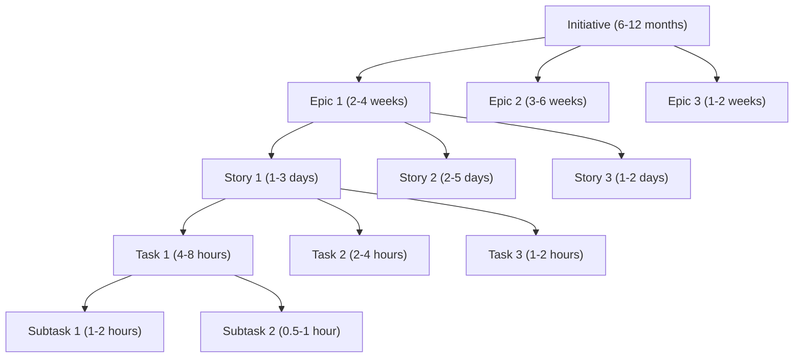

# JIRA Integration Guide

Comprehensive setup and configuration guide for integrating the Hierarchical Agent System with Atlassian JIRA.

---

## 📚 Table of Contents

1. [Prerequisites](#prerequisites)
2. [JIRA Setup & Configuration](#jira-setup--configuration)
3. [Authentication Methods](#authentication-methods)
4. [Advanced Roadmaps Configuration](#advanced-roadmaps-configuration)
5. [Custom Fields & Issue Types](#custom-fields--issue-types)
6. [Bulk Operations & Performance](#bulk-operations--performance)
7. [Project Permissions & Security](#project-permissions--security)
8. [Integration Examples](#integration-examples)
9. [Troubleshooting](#troubleshooting)
10. [Best Practices](#best-practices)

---

## Prerequisites

### JIRA Requirements

| Requirement | Minimum Version | Recommended Version | Notes |
|-------------|----------------|---------------------|-------|
| **JIRA Cloud** | Any version | Latest | Full feature support |
| **JIRA Server** | 8.0+ | 9.0+ | Some features require newer versions |
| **JIRA Data Center** | 8.0+ | 9.0+ | Optimal for enterprise deployments |
| **Advanced Roadmaps** | - | Required for full hierarchy support | Previously known as Portfolio |

### Required JIRA Features

- ✅ **Issue Types**: Initiative, Epic, Story, Task, Sub-task
- ✅ **Custom Fields**: For enhanced metadata
- ✅ **Advanced Roadmaps**: For enterprise planning (recommended)
- ✅ **API Access**: REST API v3 with appropriate permissions
- ✅ **Project Administration**: To create and modify project settings

### User Permissions

The JIRA user account must have:

```
Project Permissions:
✓ Browse Project
✓ Create Issues
✓ Edit Issues
✓ Link Issues
✓ Manage Sprints (if using Scrum)
✓ Administer Project (for setup)

Global Permissions:
✓ JIRA Users
✓ Browse Users and Groups (optional)
✓ JIRA System Administrators (for initial setup)
```

---

## JIRA Setup & Configuration

### Step 1: Create API Token

#### For JIRA Cloud:

1. **Log in to Atlassian Account**
   - Go to [https://id.atlassian.com/manage-profile/security/api-tokens](https://id.atlassian.com/manage-profile/security/api-tokens)
   - Click **Create API token**

2. **Generate Token**
   ```
   Label: Hierarchical Agent System
   Description: API access for project automation
   ```

3. **Copy and Store Token**
   ```bash
   # Store securely - this is your JIRA_API_TOKEN
   # Example: ATATxxxxxxxxxxxxxxxxx
   ```

#### For JIRA Server/Data Center:

1. **Create Application Link** (Admin required)
   ```
   Administration > Applications > Application links
   URL: https://your-hierarchical-system.com
   Application Name: Hierarchical Agent System
   Application Type: Generic Application
   ```

2. **Generate Personal Access Token** (JIRA 8.14+)
   ```
   Profile > Personal Access Tokens
   Token name: HierarchicalAgent
   Permissions: Read/Write access to projects
   ```

### Step 2: Configure Project Structure

#### Create or Configure JIRA Project

```bash
# Using JIRA CLI or Web Interface
Project Settings:
  - Project Type: Software Development
  - Template: Scrum or Kanban
  - Key: UNIQUE_KEY (e.g., "ECOM", "DASH")
  - Name: Descriptive project name
```

#### Required Issue Types

Ensure these issue types are available in your project:

```json
{
  "issueTypes": [
    {
      "name": "Initiative",
      "description": "Large strategic project or program",
      "iconUrl": "initiative-icon.png",
      "hierarchyLevel": 1
    },
    {
      "name": "Epic",
      "description": "Large feature or capability",
      "iconUrl": "epic-icon.png",
      "hierarchyLevel": 2
    },
    {
      "name": "Story",
      "description": "User story or requirement",
      "iconUrl": "story-icon.png",
      "hierarchyLevel": 3
    },
    {
      "name": "Task",
      "description": "Development or implementation task",
      "iconUrl": "task-icon.png",
      "hierarchyLevel": 4
    },
    {
      "name": "Sub-task",
      "description": "Subtask under a parent task",
      "iconUrl": "subtask-icon.png",
      "hierarchyLevel": 5
    }
  ]
}
```

### Step 3: System Configuration

#### Environment Variables Setup

```bash
# Create .env file
cat > .env << EOF
# JIRA Configuration
JIRA_HOST_URL=https://your-domain.atlassian.net
JIRA_USERNAME=your-email@company.com
JIRA_API_TOKEN=your-api-token-here

# Optional: Default project settings
JIRA_DEFAULT_PROJECT=ECOM
JIRA_DEFAULT_ASSIGNEE=project-manager
JIRA_ENABLE_ROADMAPS=true

# Performance settings
JIRA_MAX_BATCH_SIZE=50
JIRA_REQUEST_TIMEOUT=30000
JIRA_RETRY_ATTEMPTS=3
EOF
```

#### Configuration File Setup

```json
// hierarchical-config.json
{
  "jiraConnect": {
    "hostUrl": "https://company.atlassian.net",
    "enableAdvancedRoadmaps": true,
    "defaultProject": "ECOM",
    "bulkOperations": {
      "maxBatchSize": 50,
      "concurrency": 5,
      "retryAttempts": 3
    },
    "customFields": {
      "initiative": {
        "businessValue": "customfield_10100",
        "strategicAlignment": "customfield_10101",
        "roi": "customfield_10102"
      },
      "epic": {
        "epicName": "customfield_10103",
        "epicColor": "customfield_10104",
        "epicStatus": "customfield_10105"
      },
      "story": {
        "storyPoints": "customfield_10106",
        "acceptanceCriteria": "customfield_10107",
        "testScenarios": "customfield_10108"
      }
    },
    "issueTypes": {
      "initiative": "10000",
      "epic": "10001", 
      "story": "10002",
      "task": "10003",
      "subtask": "10004"
    },
    "workflow": {
      "defaultStatus": "To Do",
      "enableTransitions": true,
      "autoAssignment": true
    }
  }
}
```

---

## Authentication Methods

### Method 1: Basic Authentication (Recommended for Cloud)

```typescript
import { JiraConnectAgent } from '@caia/hierarchical-agent-system';

const jiraAgent = new JiraConnectAgent({
  hostUrl: 'https://company.atlassian.net',
  username: 'your-email@company.com',
  apiToken: process.env.JIRA_API_TOKEN // API Token acts as password
});

await jiraAgent.initialize();
```

### Method 2: Personal Access Token (Server/Data Center)

```typescript
const jiraAgent = new JiraConnectAgent({
  hostUrl: 'https://jira.company.com',
  authMethod: 'personal-access-token',
  personalAccessToken: process.env.JIRA_PAT
});
```

### Method 3: OAuth 2.0 (Advanced)

```typescript
const jiraAgent = new JiraConnectAgent({
  hostUrl: 'https://company.atlassian.net',
  authMethod: 'oauth2',
  oauth: {
    clientId: process.env.JIRA_OAUTH_CLIENT_ID,
    clientSecret: process.env.JIRA_OAUTH_CLIENT_SECRET,
    redirectUri: 'http://localhost:3000/callback',
    scopes: ['read:jira-work', 'write:jira-work']
  }
});
```

### Method 4: Service Account (Enterprise)

```typescript
// For enterprise deployments with dedicated service accounts
const jiraAgent = new JiraConnectAgent({
  hostUrl: 'https://jira.company.com',
  authMethod: 'service-account',
  serviceAccount: {
    username: 'hierarchical-service',
    keyFile: '/path/to/service-key.json'
  }
});
```

---

## Advanced Roadmaps Configuration

### Enable Advanced Roadmaps

1. **JIRA Cloud**: Available in Premium and Enterprise plans
2. **JIRA Server/DC**: Install Advanced Roadmaps app

### Configure Hierarchy Levels

```typescript
// Advanced Roadmaps hierarchy configuration
const roadmapsConfig = {
  hierarchy: [
    {
      level: 0,
      name: "Initiative",
      issueType: "Initiative",
      color: "#FF5722"
    },
    {
      level: 1, 
      name: "Epic",
      issueType: "Epic",
      color: "#9C27B0",
      parent: "Initiative"
    },
    {
      level: 2,
      name: "Story", 
      issueType: "Story",
      color: "#4CAF50",
      parent: "Epic"
    },
    {
      level: 3,
      name: "Task",
      issueType: "Task", 
      color: "#2196F3",
      parent: "Story"
    }
  ],
  planning: {
    enableCapacityPlanning: true,
    enableDependencyTracking: true,
    enableRiskTracking: true,
    defaultTimeframe: "quarters"
  }
};
```

### Create Roadmap Plans

```typescript
// Automatically create roadmap plan for project
const createRoadmapPlan = async (projectKey: string) => {
  const planConfig = {
    name: `${projectKey} - Hierarchical Roadmap`,
    description: "Auto-generated roadmap from Hierarchical Agent System",
    projects: [projectKey],
    hierarchy: roadmapsConfig.hierarchy,
    settings: {
      showDependencies: true,
      showProgress: true,
      showRisks: true,
      timeframe: "monthly"
    }
  };
  
  const plan = await jiraAgent.createRoadmapPlan(planConfig);
  console.log(`Created roadmap plan: ${plan.id}`);
  
  return plan;
};
```

---

## Custom Fields & Issue Types

### Custom Field Configuration

#### Step 1: Identify Required Custom Fields

```bash
# Get existing custom fields
curl -u email@company.com:api-token \
  -X GET \
  -H "Content-Type: application/json" \
  "https://company.atlassian.net/rest/api/3/field"
```

#### Step 2: Create Custom Fields (if needed)

```typescript
// Custom field creation for enhanced metadata
const customFields = {
  // For Initiatives
  businessValue: {
    name: "Business Value",
    type: "select",
    options: ["Low", "Medium", "High", "Critical"],
    description: "Expected business value of this initiative"
  },
  
  // For Epics  
  epicPoints: {
    name: "Epic Points",
    type: "number", 
    description: "Story points estimate for entire epic"
  },
  
  // For Stories
  acceptanceCriteria: {
    name: "Acceptance Criteria",
    type: "textarea",
    description: "Detailed acceptance criteria for the story"
  },
  
  // For Tasks
  technicalNotes: {
    name: "Technical Notes",
    type: "textarea",
    description: "Implementation notes and technical details"
  }
};

// Create custom fields programmatically
const createCustomFields = async () => {
  for (const [key, field] of Object.entries(customFields)) {
    const result = await jiraAgent.createCustomField(field);
    console.log(`Created custom field '${field.name}': ${result.id}`);
  }
};
```

#### Step 3: Configure Field Mappings

```typescript
// Map system fields to JIRA custom fields
const fieldMappings = {
  // Initiative mappings
  'initiative.businessValue': 'customfield_10100',
  'initiative.strategicAlignment': 'customfield_10101',
  'initiative.roi': 'customfield_10102',
  
  // Epic mappings
  'epic.name': 'customfield_10103',
  'epic.color': 'customfield_10104', 
  'epic.points': 'customfield_10105',
  
  // Story mappings
  'story.points': 'customfield_10106',
  'story.acceptanceCriteria': 'customfield_10107',
  'story.testScenarios': 'customfield_10108',
  
  // Task mappings
  'task.estimatedHours': 'customfield_10109',
  'task.technicalNotes': 'customfield_10110'
};

// Apply field mappings in system configuration
const jiraAgent = new JiraConnectAgent({
  hostUrl: 'https://company.atlassian.net',
  username: 'user@company.com',
  apiToken: process.env.JIRA_API_TOKEN,
  fieldMappings
});
```

---

## Bulk Operations & Performance

### Batch Issue Creation

```typescript
// Optimized bulk issue creation
class OptimizedJiraOperations {
  private batchSize = 50;
  private maxConcurrency = 5;
  
  async createHierarchyInBatches(hierarchy: TaskHierarchy): Promise<BatchResult> {
    const allIssues = [
      ...hierarchy.initiatives,
      ...hierarchy.epics, 
      ...hierarchy.stories,
      ...hierarchy.tasks
    ];
    
    // Group by issue type for efficient processing
    const batches = this.groupByIssueType(allIssues);
    const results: BatchResult = {
      created: [],
      errors: [],
      timing: {}
    };
    
    // Process each issue type in sequence to maintain relationships
    for (const [issueType, issues] of batches) {
      const startTime = Date.now();
      
      const typeResults = await this.processBatchesByType(
        issueType, 
        issues
      );
      
      results.created.push(...typeResults.created);
      results.errors.push(...typeResults.errors);
      results.timing[issueType] = Date.now() - startTime;
      
      console.log(`Created ${typeResults.created.length} ${issueType}s in ${results.timing[issueType]}ms`);
    }
    
    return results;
  }
  
  private async processBatchesByType(
    issueType: string, 
    issues: Issue[]
  ): Promise<BatchResult> {
    const chunks = this.chunkArray(issues, this.batchSize);
    const results = {
      created: [],
      errors: []
    };
    
    // Process chunks with controlled concurrency
    const concurrencyLimit = Math.min(chunks.length, this.maxConcurrency);
    
    for (let i = 0; i < chunks.length; i += concurrencyLimit) {
      const batch = chunks.slice(i, i + concurrencyLimit);
      
      const batchPromises = batch.map(chunk => 
        this.createIssuesChunk(chunk)
      );
      
      const batchResults = await Promise.allSettled(batchPromises);
      
      for (const result of batchResults) {
        if (result.status === 'fulfilled') {
          results.created.push(...result.value.created);
          results.errors.push(...result.value.errors);
        } else {
          results.errors.push({
            error: result.reason,
            issues: 'batch-failed'
          });
        }
      }
    }
    
    return results;
  }
}
```

### Performance Optimization

```typescript
// Connection pooling and request optimization
class JiraConnectionPool {
  private connections: AxiosInstance[] = [];
  private activeRequests = 0;
  private maxConnections = 10;
  
  constructor() {
    this.initializePool();
  }
  
  private initializePool(): void {
    for (let i = 0; i < this.maxConnections; i++) {
      const connection = axios.create({
        baseURL: process.env.JIRA_HOST_URL,
        timeout: 30000,
        auth: {
          username: process.env.JIRA_USERNAME!,
          password: process.env.JIRA_API_TOKEN!
        },
        headers: {
          'Content-Type': 'application/json',
          'Accept': 'application/json'
        }
      });
      
      // Request interceptor for rate limiting
      connection.interceptors.request.use(async (config) => {
        await this.waitForRateLimit();
        this.activeRequests++;
        return config;
      });
      
      // Response interceptor for cleanup
      connection.interceptors.response.use(
        (response) => {
          this.activeRequests--;
          return response;
        },
        (error) => {
          this.activeRequests--;
          return Promise.reject(error);
        }
      );
      
      this.connections.push(connection);
    }
  }
  
  async getConnection(): Promise<AxiosInstance> {
    // Round-robin selection
    const index = this.activeRequests % this.maxConnections;
    return this.connections[index];
  }
}
```

---

## Project Permissions & Security

### Security Best Practices

#### 1. Service Account Setup

```bash
# Create dedicated service account for automation
# JIRA Administration > User Management > Create User

Service Account Details:
  Username: hierarchical-service
  Email: hierarchical-service@company.com
  Full Name: Hierarchical Agent Service
  Groups: jira-software-users, hierarchical-automation
```

#### 2. Permission Scheme Configuration

```json
{
  "permissionScheme": {
    "name": "Hierarchical Agent Permissions",
    "permissions": [
      {
        "permission": "BROWSE_PROJECT",
        "holders": ["hierarchical-service", "project-team"]
      },
      {
        "permission": "CREATE_ISSUE", 
        "holders": ["hierarchical-service"]
      },
      {
        "permission": "EDIT_ISSUE",
        "holders": ["hierarchical-service", "assignee"]
      },
      {
        "permission": "LINK_ISSUE",
        "holders": ["hierarchical-service"]
      },
      {
        "permission": "DELETE_ISSUE",
        "holders": ["project-admins"] 
      }
    ]
  }
}
```

#### 3. API Token Security

```bash
# Secure token storage using environment variables
export JIRA_API_TOKEN="$(cat /secure/path/jira-token.txt)"

# Or use secret management service
export JIRA_API_TOKEN="$(aws secretsmanager get-secret-value --secret-id jira-token --query SecretString --output text)"

# Rotate tokens regularly (recommended: every 90 days)
# Set calendar reminder for token rotation
```

#### 4. Network Security

```typescript
// IP allowlisting and request validation
class SecureJiraClient {
  private allowedIPs = [
    '10.0.0.0/8',
    '172.16.0.0/12', 
    '192.168.0.0/16'
  ];
  
  async validateRequest(request: any): Promise<boolean> {
    // Validate request source
    if (!this.isAllowedIP(request.ip)) {
      throw new SecurityError('Request from unauthorized IP');
    }
    
    // Validate request structure
    if (!this.isValidRequestStructure(request)) {
      throw new SecurityError('Invalid request structure');
    }
    
    // Rate limiting
    if (!(await this.checkRateLimit(request.user))) {
      throw new SecurityError('Rate limit exceeded');
    }
    
    return true;
  }
}
```

---

## Integration Examples

### Complete Project Setup

```typescript
import { HierarchicalAgentSystem } from '@caia/hierarchical-agent-system';

// Complete JIRA integration setup
const setupJiraIntegration = async () => {
  // 1. Initialize system with JIRA configuration
  const system = new HierarchicalAgentSystem({
    jiraConnect: {
      hostUrl: 'https://company.atlassian.net',
      username: 'pm@company.com', 
      apiToken: process.env.JIRA_API_TOKEN,
      enableAdvancedRoadmaps: true
    }
  });
  
  await system.initialize();
  
  // 2. Test JIRA connectivity
  const status = await system.getSystemStatus();
  if (status.components.jiraConnect.status !== 'healthy') {
    throw new Error('JIRA connection failed');
  }
  
  // 3. Process project with JIRA creation
  const results = await system.processProject({
    idea: "Build a comprehensive customer portal with self-service capabilities",
    context: `
      Features needed:
      - User registration and authentication
      - Account dashboard with personal information
      - Order history and tracking
      - Support ticket creation and management
      - Knowledge base search
      - Mobile-responsive design
      - Integration with existing CRM system
    `,
    projectKey: "PORTAL",
    teamContext: {
      size: 8,
      experience_level: "senior",
      timeline_months: 4
    },
    enableJiraCreation: true
  });
  
  // 4. Verify JIRA creation results
  if (results.jiraResults) {
    console.log('\n=== JIRA Integration Results ===');
    console.log(`Total issues created: ${results.jiraResults.created_issues.length}`);
    console.log(`Errors encountered: ${results.jiraResults.errors.length}`);
    
    // Display created issues by type
    const issuesByType = results.jiraResults.created_issues.reduce((acc, issue) => {
      acc[issue.type] = (acc[issue.type] || 0) + 1;
      return acc;
    }, {} as Record<string, number>);
    
    Object.entries(issuesByType).forEach(([type, count]) => {
      console.log(`- ${type}: ${count} issues`);
    });
    
    // Show sample issue keys
    console.log('\nSample created issues:');
    results.jiraResults.created_issues.slice(0, 5).forEach(issue => {
      console.log(`- ${issue.jira_key} (${issue.type})`);
    });
  }
  
  return results;
};

// Run the setup
setupJiraIntegration()
  .then(results => {
    console.log('JIRA integration completed successfully!');
  })
  .catch(error => {
    console.error('JIRA integration failed:', error);
  });
```

### Advanced Roadmaps Integration

```typescript
// Create comprehensive roadmap with timeline planning
const createProjectRoadmap = async (projectKey: string, results: ProjectResults) => {
  const jiraAgent = new JiraConnectAgent({
    hostUrl: process.env.JIRA_HOST_URL!,
    username: process.env.JIRA_USERNAME!,
    apiToken: process.env.JIRA_API_TOKEN!
  });
  
  await jiraAgent.initialize();
  
  // Create roadmap plan
  const roadmapPlan = await jiraAgent.createAdvancedRoadmap({
    name: `${projectKey} - Development Roadmap`,
    description: "Auto-generated roadmap from Hierarchical Agent System",
    projects: [projectKey],
    timeframe: {
      start: new Date(),
      end: new Date(Date.now() + 6 * 30 * 24 * 60 * 60 * 1000) // 6 months
    },
    settings: {
      showDependencies: true,
      showProgress: true,
      enableCapacityPlanning: true,
      releaseScheduling: true
    }
  });
  
  // Add timeline data to issues
  for (const epic of results.decomposition.epics) {
    const epicIssue = results.jiraResults?.created_issues.find(
      issue => issue.type === 'epic' && issue.id === epic.id
    );
    
    if (epicIssue) {
      await jiraAgent.updateIssue(epicIssue.jira_key, {
        customFields: {
          'customfield_10200': epic.estimatedStoryPoints, // Epic Points
          'customfield_10201': epic.priority, // Priority
          'customfield_10202': calculateEpicTimeline(epic) // Timeline estimate
        }
      });
    }
  }
  
  console.log(`Created Advanced Roadmap: ${roadmapPlan.url}`);
  return roadmapPlan;
};

// Helper function for timeline calculation
const calculateEpicTimeline = (epic: Epic): string => {
  const baseWeeks = Math.ceil(epic.estimatedStoryPoints / 10); // 10 points per week
  const startDate = new Date();
  const endDate = new Date(startDate.getTime() + baseWeeks * 7 * 24 * 60 * 60 * 1000);
  
  return JSON.stringify({
    start: startDate.toISOString(),
    end: endDate.toISOString(),
    duration: baseWeeks
  });
};
```

---

## Troubleshooting

### Common Issues & Solutions

#### 1. Authentication Failures

```bash
# Error: 401 Unauthorized

# Check credentials
curl -u "email@company.com:api-token" \
  -H "Content-Type: application/json" \
  "https://company.atlassian.net/rest/api/3/myself"

# If successful, returns user info
# If failed, check:
# - Email address is correct
# - API token is valid and not expired
# - Account has JIRA access
```

#### 2. Permission Errors

```bash
# Error: 403 Forbidden

# Check project permissions
curl -u "email@company.com:api-token" \
  "https://company.atlassian.net/rest/api/3/project/PROJECTKEY/permissionscheme"

# Verify user has required permissions:
# - Browse Project
# - Create Issues 
# - Edit Issues
# - Link Issues
```

#### 3. Custom Field Issues

```typescript
// Debug custom field configuration
const debugCustomFields = async () => {
  const jiraAgent = new JiraConnectAgent(config);
  
  // Get all available fields
  const fields = await jiraAgent.getFields();
  
  // Find custom fields
  const customFields = fields.filter(field => field.custom);
  
  console.log('Available custom fields:');
  customFields.forEach(field => {
    console.log(`- ${field.name}: ${field.id}`);
  });
  
  // Test field access
  for (const field of customFields) {
    try {
      const contexts = await jiraAgent.getFieldContexts(field.id);
      console.log(`Field ${field.name} has ${contexts.length} contexts`);
    } catch (error) {
      console.error(`Cannot access field ${field.name}:`, error.message);
    }
  }
};
```

#### 4. Rate Limiting

```typescript
// Handle rate limiting gracefully
class RateLimitedJiraClient {
  private requestCount = 0;
  private lastReset = Date.now();
  private readonly maxRequests = 100; // JIRA Cloud: 100 requests per minute
  
  async makeRequest(config: RequestConfig): Promise<any> {
    await this.enforceRateLimit();
    
    try {
      const response = await axios(config);
      this.requestCount++;
      return response.data;
    } catch (error) {
      if (error.response?.status === 429) {
        // Rate limited - wait and retry
        const retryAfter = error.response.headers['retry-after'] || 60;
        console.log(`Rate limited. Waiting ${retryAfter}s...`);
        await this.sleep(retryAfter * 1000);
        return this.makeRequest(config);
      }
      throw error;
    }
  }
  
  private async enforceRateLimit(): Promise<void> {
    const now = Date.now();
    const timeSinceReset = now - this.lastReset;
    
    if (timeSinceReset >= 60000) {
      // Reset counter every minute
      this.requestCount = 0;
      this.lastReset = now;
    } else if (this.requestCount >= this.maxRequests) {
      // Wait until next minute
      const waitTime = 60000 - timeSinceReset;
      await this.sleep(waitTime);
      this.requestCount = 0;
      this.lastReset = Date.now();
    }
  }
}
```

#### 5. Large Hierarchy Performance

```typescript
// Optimize performance for large hierarchies
const optimizeForLargeHierarchy = {
  // Batch size optimization
  batchSize: Math.min(50, Math.ceil(totalIssues / 10)),
  
  // Concurrency limits
  maxConcurrency: Math.min(5, Math.ceil(totalIssues / 100)),
  
  // Enable compression
  compression: true,
  
  // Use persistent connections
  keepAlive: true,
  
  // Implement progress tracking
  progressCallback: (completed: number, total: number) => {
    const percent = Math.round((completed / total) * 100);
    console.log(`Progress: ${completed}/${total} (${percent}%)`);
  }
};
```

---

## Best Practices

### 1. Project Structure

```typescript
// Recommended project setup
const projectBestPractices = {
  naming: {
    projects: "SHORT_ACRONYM", // e.g., "ECOM", "DASH", "API"
    epics: "Epic: [Feature Name]", // e.g., "Epic: User Authentication"
    stories: "[As a X, I want Y so that Z]", // Standard user story format
    tasks: "[Action] [Component]", // e.g., "Implement login API"
  },
  
  labels: {
    priority: ["critical", "high", "medium", "low"],
    type: ["feature", "bugfix", "technical-debt", "research"],
    team: ["frontend", "backend", "devops", "qa"],
    status: ["ready", "in-progress", "review", "done"]
  },
  
  customFields: {
    storyPoints: "Use Fibonacci sequence (1,2,3,5,8,13,21)",
    acceptanceCriteria: "GIVEN-WHEN-THEN format",
    definition_of_done: "Checklist format"
  }
};
```

### 2. Hierarchy Design



### 3. Performance Guidelines

| Operation | Batch Size | Concurrency | Expected Time |
|-----------|------------|-------------|---------------|
| **Small Project** (<50 issues) | 10 | 2 | 30-60 seconds |
| **Medium Project** (50-200 issues) | 25 | 3 | 2-5 minutes |
| **Large Project** (200-500 issues) | 50 | 5 | 5-15 minutes |
| **Enterprise Project** (500+ issues) | 50 | 5 | 15+ minutes |

### 4. Error Handling

```typescript
// Robust error handling for JIRA operations
const handleJiraErrors = async (operation: () => Promise<any>) => {
  const maxRetries = 3;
  let lastError: Error;
  
  for (let attempt = 1; attempt <= maxRetries; attempt++) {
    try {
      return await operation();
    } catch (error) {
      lastError = error;
      
      // Check if error is retryable
      if (error.response?.status === 429 || error.response?.status >= 500) {
        const delay = Math.pow(2, attempt) * 1000; // Exponential backoff
        console.log(`Attempt ${attempt} failed, retrying in ${delay}ms...`);
        await new Promise(resolve => setTimeout(resolve, delay));
        continue;
      }
      
      // Non-retryable error
      break;
    }
  }
  
  throw new Error(`Operation failed after ${maxRetries} attempts: ${lastError.message}`);
};
```

### 5. Monitoring & Logging

```typescript
// Comprehensive logging for JIRA operations
class JiraOperationLogger {
  private operations: OperationLog[] = [];
  
  logOperation(operation: OperationLog): void {
    this.operations.push({
      ...operation,
      timestamp: new Date().toISOString()
    });
    
    // Real-time logging
    console.log(`[JIRA] ${operation.type}: ${operation.description}`);
    
    // Persist to file for audit
    this.persistLog(operation);
  }
  
  generateReport(): OperationReport {
    const totalOperations = this.operations.length;
    const successful = this.operations.filter(op => op.success).length;
    const failed = totalOperations - successful;
    
    return {
      summary: {
        total: totalOperations,
        successful,
        failed,
        successRate: (successful / totalOperations) * 100
      },
      timing: {
        averageTime: this.calculateAverageTime(),
        totalTime: this.calculateTotalTime()
      },
      errors: this.operations.filter(op => !op.success)
    };
  }
}
```

---

This comprehensive JIRA Integration Guide provides everything needed to successfully integrate the Hierarchical Agent System with JIRA, from basic setup to advanced enterprise configurations. The system is designed to work seamlessly with JIRA's powerful project management capabilities while adding intelligent automation and structured hierarchy creation.