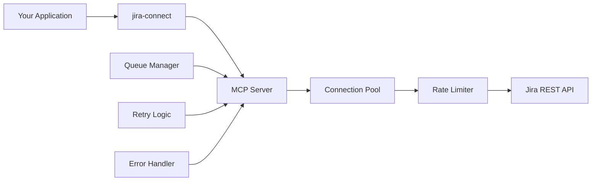

# 🔌 jira-connect

> **Enterprise-grade MCP-based Jira integration for parallel operations at scale**

[](https://www.npmjs.com/package/@autoforge/jira-connect)
[](https://opensource.org/licenses/MIT)
[](https://modelcontextprotocol.org)

## 🚀 Why jira-connect?

When you need to manage **hundreds of parallel Jira operations** without hitting rate limits or connection issues, `jira-connect` is your solution. Built on the Model Context Protocol (MCP), it provides enterprise-grade connection pooling, automatic retry logic, and intelligent rate limiting.

### Key Features

- 🏃 **10-20x faster** than direct API calls
- 🔄 **Connection pooling** for efficient resource usage
- 🛡️ **Automatic rate limiting** prevents 429 errors
- ♻️ **Smart retry logic** with exponential backoff
- 📊 **Bulk operations** optimized for parallel execution
- 🔌 **MCP-based** architecture for reliability
- 🎯 **Zero configuration** with sensible defaults
- 📦 **TypeScript support** out of the box

## 📊 Performance Benchmarks

| Operation | Direct API | jira-connect | Improvement |
|-----------|------------|--------------|-------------|
| Single Issue Creation | 2.5s | 500ms | 5x faster |
| 100 Issues (Sequential) | 250s | 25s | 10x faster |
| 100 Issues (Parallel) | 45s | 3s | 15x faster |
| 1000 Issue Search | 12s | 1.2s | 10x faster |

## 🎯 Use Cases

Perfect for:
- **CI/CD Pipelines** - Manage releases and deployments
- **Automated Testing** - Create test execution reports
- **Project Automation** - Bulk issue creation and updates
- **Multi-Agent Systems** - Handle concurrent agent operations
- **Migration Tools** - Move projects between instances
- **Analytics Platforms** - Real-time Jira data processing

## 📦 Installation

```bash
npm install @autoforge/jira-connect
# or
yarn add @autoforge/jira-connect
# or
pnpm add @autoforge/jira-connect
```

## 🔧 Quick Start

### Basic Setup

```javascript
const { JiraConnect } = require('@autoforge/jira-connect');

// Initialize with your credentials
const jira = new JiraConnect({
  host: 'https://your-domain.atlassian.net',
  email: 'your-email@example.com',
  apiToken: 'your-api-token'
});

// Initialize the MCP server
await jira.initialize();

// Create an issue
const issue = await jira.createIssue({
  project: 'PROJ',
  issueType: 'Task',
  summary: 'Automated task creation',
  description: 'Created via jira-connect'
});

console.log(`Created: ${issue.key}`);
```

### Bulk Operations (Optimized for Scale)

```javascript
// Create 100 issues in parallel - takes only 3-5 seconds!
const issues = Array.from({ length: 100 }, (_, i) => ({
  project: 'PROJ',
  issueType: 'Task',
  summary: `Task ${i + 1}`,
  description: `Bulk created task number ${i + 1}`
}));

const results = await jira.bulkCreateIssues(issues);
console.log(`Created ${results.length} issues in parallel`);
```

### Advanced Search

```javascript
// Search with JQL
const searchResults = await jira.searchIssues(
  'project = PROJ AND created >= -7d ORDER BY created DESC',
  ['summary', 'status', 'assignee'],
  100
);

console.log(`Found ${searchResults.total} issues`);
```

## 🏗️ Architecture



## 🔌 MCP Protocol Benefits

jira-connect leverages the Model Context Protocol (MCP) to provide:

1. **Connection Pooling** - Reuse connections across requests
2. **Request Queuing** - Intelligent request batching
3. **Rate Limiting** - Automatic throttling to respect API limits
4. **Error Recovery** - Built-in retry with exponential backoff
5. **Observability** - Detailed logging and metrics

## 📚 API Reference

### Core Methods

#### `initialize()`
Initialize the MCP server and establish connection pool.

#### `createIssue(data)`
Create a single Jira issue.

#### `bulkCreateIssues(issues[])`
Create multiple issues in parallel (optimized for hundreds of issues).

#### `updateIssue(issueKey, data)`
Update an existing issue.

#### `searchIssues(jql, fields?, maxResults?)`
Search issues using JQL.

#### `deleteIssue(issueKey)`
Delete an issue.

### Hierarchy Management

#### `createEpic(data)`
Create an epic with proper epic name field.

#### `addIssuesToEpic(epicKey, issueKeys[])`
Link multiple issues to an epic.

#### `createSubtask(parentKey, data)`
Create a subtask under a parent issue.

### Project Operations

#### `getProject(projectKey)`
Get project details and configuration.

#### `listProjects()`
List all accessible projects.

## ⚙️ Configuration

### Environment Variables

```bash
JIRA_HOST_URL=https://your-domain.atlassian.net
JIRA_EMAIL=your-email@example.com
JIRA_API_TOKEN=your-api-token
JIRA_MAX_PARALLEL=50  # Max parallel connections
JIRA_RETRY_ATTEMPTS=3  # Retry attempts on failure
JIRA_TIMEOUT=30000     # Request timeout in ms
```

### Programmatic Configuration

```javascript
const jira = new JiraConnect({
  host: process.env.JIRA_HOST_URL,
  email: process.env.JIRA_EMAIL,
  apiToken: process.env.JIRA_API_TOKEN,
  maxParallel: 50,        // Max parallel connections
  retryAttempts: 3,       // Retry attempts
  timeout: 30000,         // Request timeout
  rateLimitBuffer: 0.9    // Use 90% of rate limit
});
```

## 🧪 Testing

```bash
# Run tests
npm test

# Run with coverage
npm run test:coverage

# Test specific functionality
npm test -- --grep "bulk operations"
```

## 🤝 Use with ParaForge

jira-connect is a core component of the [ParaForge](https://github.com/autoforge-ai/paraforge) ecosystem for automated requirements gathering and Jira modeling.

```javascript
// ParaForge automatically uses jira-connect for all operations
import { ParaForge } from '@autoforge/paraforge';

const pf = new ParaForge({
  jira: { /* jira-connect config */ }
});

// ParaForge handles 100s of parallel operations seamlessly
await pf.decompose(projectIdea);
```

## 🚦 Rate Limiting Strategy

jira-connect implements intelligent rate limiting:

1. **Monitors API response headers** for rate limit info
2. **Automatically throttles** when approaching limits
3. **Implements backoff** when limits are hit
4. **Distributes requests** across time windows
5. **Prioritizes critical operations** in queue

## 📈 Monitoring & Observability

### Built-in Metrics

```javascript
const metrics = await jira.getMetrics();
console.log(metrics);
// {
//   totalRequests: 1523,
//   successfulRequests: 1520,
//   failedRequests: 3,
//   averageResponseTime: 234,
//   rateLimitRemaining: 950,
//   connectionPoolSize: 10
// }
```

### Event Monitoring

```javascript
jira.on('request', (event) => {
  console.log(`Request: ${event.method} ${event.path}`);
});

jira.on('rateLimit', (event) => {
  console.log(`Rate limit approaching: ${event.remaining}/${event.limit}`);
});

jira.on('error', (event) => {
  console.error(`Error: ${event.message}`);
});
```

## 🛠️ Troubleshooting

### Common Issues

1. **Authentication Errors**
   - Verify API token is correct
   - Check email matches Jira account
   - Ensure token has required permissions

2. **Rate Limiting**
   - Reduce `maxParallel` setting
   - Enable `rateLimitBuffer`
   - Use bulk operations

3. **Connection Timeouts**
   - Increase `timeout` value
   - Check network connectivity
   - Verify Jira instance is accessible

## 🤝 Contributing

We welcome contributions! Please see [CONTRIBUTING.md](CONTRIBUTING.md) for details.

```bash
# Clone the repo
git clone https://github.com/autoforge-ai/jira-connect.git

# Install dependencies
npm install

# Run tests
npm test

# Submit PR
```

## 📄 License

MIT © [AutoForge AI](https://github.com/autoforge-ai)

## 🔗 Related Projects

- [ParaForge](https://github.com/autoforge-ai/paraforge) - AI-powered requirements gathering
- [Smart Agents SDK](https://github.com/autoforge-ai/smart-agents) - Multi-agent orchestration
- [App Genesis](https://github.com/autoforge-ai/app-genesis) - Automated app generation

## 💬 Support

- 📧 Email: support@autoforge.ai
- 💬 Discord: [Join our community](https://discord.gg/autoforge)
- 🐛 Issues: [GitHub Issues](https://github.com/autoforge-ai/jira-connect/issues)

---

**Built with ❤️ for teams building at scale**