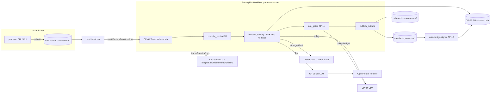
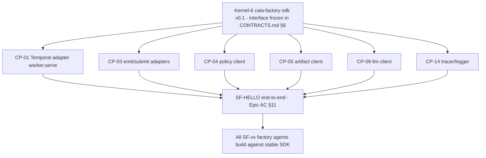

# CAIA Platform Architecture (Kernel Wave 1)

**Authority:** STOL-1034 (Initiative) / STOL-1035 (Epic 1). Interfaces: see `CONTRACTS.md` (canonical, frozen v0.1.0).

CAIA (Composable AI Assembly) is the Stolution software factory: 96 pipeline microfactories (SF-00..SF-140) + 15 control-plane components. This repo (`caia-platform`) is the standalone home of the kernel, the factory SDK, and the factories — separate from the Stolution product monorepo by design.

## 1. Component map (Wave 1)

| CP | Component | Runtime | New or reused |
|----|-----------|---------|---------------|
| CP-01 | Temporal OSS | `caia-temporal` (+ UI) | **new** (PG16 backend reused) |
| CP-03 | Kafka + CloudEvents 1.0 | `stolution-kafka` | **reused** (ADR-097) |
| CP-04 | OPA | `caia-opa` | **new** (Kyverno stays k8s-side) |
| CP-05 | MinIO + provenance | `stolution-minio` + PG `caia.artifact_provenance` | **reused** + new schema |
| CP-06 | PostgreSQL 16 | existing PG | **reused** (schema `caia`) |
| CP-09 | LiteLLM gateway | `caia-litellm` | **new** (OpenRouter free tier only) |
| CP-11 | Gate SDK | inside `caia-factory-sdk` | **new** (adapters to reviewer-agent / live-verify-runner / chaos-harness) |
| CP-14 | OTEL/Loki/Tempo/Grafana/Prometheus | existing stack + factory-otel (STOL-865) | **reused** (CAIA span conventions) |
| CP-15 | Audit/provenance + Cosign | Loki + PG + `caia-cosign-signer` consumer | **new thin layer** on reused stores |

## 2. How a run flows



Deterministic contracts around every box: inputs validated (pydantic) before execution, outputs validated after, gates decide publication, every side effect (LLM, artifact, event) goes through the `FactoryContext` and is policy-checked, priced, traced, and provenance-tracked.

## 3. Dependency order (why the SDK lands first)



Because §6 of CONTRACTS.md freezes the SDK surface, the eight component agents build **in parallel** against the spec; integration risk concentrates at SF-HELLO, which is the acceptance instrument (KID-010).

## 4. Repository layout

```
caia-platform/
├── CONTRACTS.md                  # canonical interfaces (frozen)
├── ARCHITECTURE.md               # this file
├── packages/
│   └── caia-factory-sdk/         # Kernel-6: caia_sdk (microfactory, FactoryContext, gates, worker)
├── services/
│   ├── temporal/                 # CP-01 docker-compose + config
│   ├── litellm/                  # CP-09 compose + model alias config
│   ├── opa/                      # CP-04 compose
│   └── cosign-signer/            # CP-15 event consumer
├── policies/                     # CP-04 rego bundles (caia.base, caia.factories.*)
├── migrations/                   # CP-05/CP-06 sql (schema caia)
├── context/                      # §8 static context corpus per factory
├── factories/
│   └── hello/                    # SF-HELLO reference factory
├── observability/                # CP-14 dashboards (Grafana folder CAIA), alert rules
└── docs/
    └── acceptance/caia-kernel-wave-1.md   # DoD sweep evidence
```

## 5. Deployment topology

- Host: s903 (stolution box), docker network `stolution`, $0 recurring ([[cost-signoff-rule]], [[ci-cost-elimination-direction]]).
- New containers: `caia-temporal`, `caia-temporal-ui`, `caia-opa`, `caia-litellm`, `caia-cosign-signer`, `caia-worker` (Temporal worker running registered factories).
- Reused: `stolution-kafka`, `stolution-minio`, PostgreSQL 16, Loki/Tempo/Prometheus/Grafana, factory-otel collector.
- Secrets: Vault only (`secret/stolution/prod/{minio,openrouter,cosign}`) — never in compose files or prompts.
- Public surface: `caia.stolution.com` (CF tunnel) → CAIA UI (thin-slice workstream owns it); Temporal UI + Grafana CAIA folder are the operator windows into the kernel.
- CI: stolution self-hosted runners; SDK test suite runs `caia_sdk.run_local(...)` conformance (no paid CI).

## 6. What Wave 2 adds (context, not scope)

CP-02 LangGraph/agent adapter, CP-07 knowledge graph, CP-08 pgvector RAG behind the same `compile_context` signature, CP-10 MCP tool gateway, CP-13 full cost governor (extends the OPA budget baseline). None of these change Wave-1 interfaces — that is the design constraint that makes them Wave 2.
