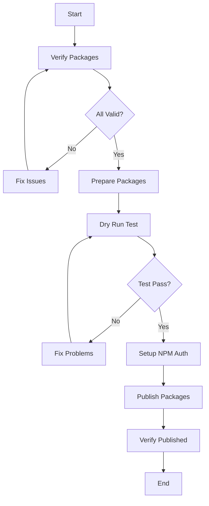

# CAIA Publishing Scripts

This directory contains scripts for preparing and publishing CAIA packages to NPM.

## 📜 Available Scripts

### 🔍 verify-packages.sh
Basic package verification without external dependencies.
```bash
./scripts/verify-packages.sh
```

### 🛠️ prepare-npm-publish.sh
Full package preparation and validation (requires `jq`).
```bash
# Install jq first if not available
brew install jq  # macOS
# or
sudo apt-get install jq  # Ubuntu/Debian

# Run preparation
./scripts/prepare-npm-publish.sh
```

### 🚀 npm-publish.sh
Complete NPM publishing pipeline.
```bash
# Dry run (test without publishing)
./scripts/npm-publish.sh --dry-run

# Publish all packages
./scripts/npm-publish.sh

# Publish specific packages
PACKAGES="packages/core packages/utils/cc-orchestrator" ./scripts/npm-publish.sh

# Force publish (override existing versions)
./scripts/npm-publish.sh --force

# Skip tests and build steps
./scripts/npm-publish.sh --skip-tests --skip-build
```

## 🎯 Quick Start

1. **Verify packages** (no dependencies required):
   ```bash
   ./scripts/verify-packages.sh
   ```

2. **Install jq** for full functionality:
   ```bash
   brew install jq
   ```

3. **Prepare packages** for publishing:
   ```bash
   ./scripts/prepare-npm-publish.sh
   ```

4. **Test publishing** with dry run:
   ```bash
   npm run publish:dry-run
   ```

5. **Setup NPM authentication**:
   ```bash
   npm login
   # or
   export NPM_TOKEN=your_token
   ```

6. **Publish packages**:
   ```bash
   npm run publish:all
   ```

## 📋 NPM Scripts (from root package.json)

| Script | Description | Command |
|--------|-------------|---------|
| `publish:prepare` | Prepare all packages | `./scripts/prepare-npm-publish.sh` |
| `publish:dry-run` | Test publishing | `./scripts/npm-publish.sh --dry-run` |
| `publish:all` | Publish all packages | `./scripts/npm-publish.sh` |
| `publish:force` | Force publish | `./scripts/npm-publish.sh --force` |
| `publish:core` | Publish core only | Selected packages |
| `publish:agents` | Publish agents only | Selected packages |
| `publish:engines` | Publish engines only | Selected packages |
| `publish:utils` | Publish utils only | Selected packages |

## 🔧 Environment Variables

| Variable | Description | Example |
|----------|-------------|---------|
| `DRY_RUN` | Test mode | `DRY_RUN=true ./scripts/npm-publish.sh` |
| `FORCE_PUBLISH` | Override existing | `FORCE_PUBLISH=true ./scripts/npm-publish.sh` |
| `SKIP_TESTS` | Skip testing | `SKIP_TESTS=true ./scripts/npm-publish.sh` |
| `SKIP_BUILD` | Skip building | `SKIP_BUILD=true ./scripts/npm-publish.sh` |
| `NPM_TOKEN` | Authentication | `NPM_TOKEN=npm_xxx ./scripts/npm-publish.sh` |
| `PACKAGES` | Specific packages | `PACKAGES="packages/core" ./scripts/npm-publish.sh` |

## 🔍 Troubleshooting

### Common Issues

#### Missing jq
```bash
# Install jq
brew install jq  # macOS
sudo apt-get install jq  # Ubuntu
# or use basic verification script
./scripts/verify-packages.sh
```

#### Permission denied
```bash
# Make scripts executable
chmod +x scripts/*.sh
```

#### NPM authentication
```bash
# Check current user
npm whoami

# Login if needed
npm login

# Or use token
export NPM_TOKEN=your_token
```

#### Build failures
```bash
# Clean and rebuild
npm run clean
npm install
npm run build:all
```

## 📊 Publishing Workflow



## 📁 Generated Files

| File | Description | Location |
|------|-------------|----------|
| `npm-publish-report.md` | Preparation report | Root directory |
| `npm-publish-results.md` | Publishing results | Root directory |
| Package modifications | Updated package.json files | Individual packages |

## 🎯 Best Practices

1. **Always run verification first**: `./scripts/verify-packages.sh`
2. **Test with dry run**: `npm run publish:dry-run`
3. **Publish core packages first**: `npm run publish:core`
4. **Monitor for errors**: Check generated reports
5. **Verify published packages**: Visit NPM to confirm

## 📚 Dependencies

### Required
- Node.js >= 18.0.0
- npm >= 9.0.0
- Git

### Optional (but recommended)
- jq (for full validation)
- TypeScript (for building)
- Lerna (for workspace management)

## 🔐 Security Notes

- Never commit NPM tokens to git
- Use environment variables for sensitive data
- Always verify package contents before publishing
- Check for sensitive files in package.json `files` array
- Review generated reports before publishing

---

*For more information, see [PACKAGES.md](../PACKAGES.md) for complete package registry.*